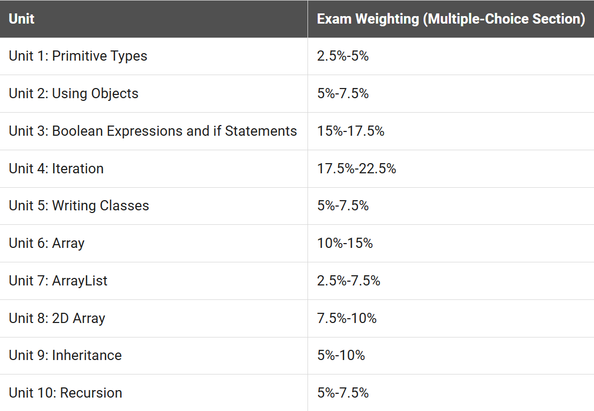

我尽量每个问题两句话内说完

## Q: 考什么？

A: Java基础

## Q: Java是什么？

A: 一种面向对象 (Object oriented programming 简称 OOP) 编程语言，常用于网站后端和安卓软件开发，其它的用处你要用也能用，知名的沙盒游戏Minecraft就是它写的

至于面向对象是什么……我后面会讲

## Q: 考数据结构之类的复杂的东西吗？

A: 不，会基础就好，最难也就递归了

## Q: 难学吗？

A: 个人认为理解了本质就很好上手，下面是考试大纲，我接下来的文章会按照我自己的新编排序来讲，理解完再回去看大纲然后刷题，结束

### 考试大纲

