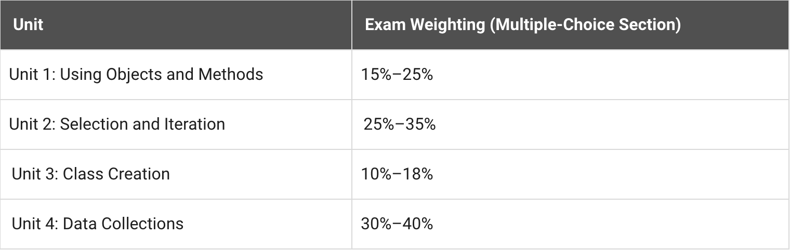


因为目前仍在施工中，部分内容仍未完成。标题中所有标记了“WIP（Working in progress）”的都是未完成的部分


以下是一些考试的概况，我尽量每个问题两句话内说完

## Q: 考什么？

A: Java基础，配上一些非常非常简单的排序算法

## Q: Java是什么？

A: 一种面向对象 (Object oriented programming 简称 OOP) 编程语言，常用于网站后端和安卓软件开发，其它的用处你要用也能用，知名的沙盒游戏Minecraft就是它写的

至于面向对象是什么……我后面会讲

## Q: 考数据结构之类的复杂的东西吗？

A: 不，会基础就好，最难也就递归、归并排序和二分查找了，这几个也考的不深

## Q: 难学吗？

A: 个人认为理解了本质就很好上手，下面是考试大纲，我接下来的文章会按照我自己对于编程的理解的新编排序来讲，理解完再回去看大纲然后刷题，5分手到擒来

我接下来将会以我自己重组过的顺序来把 Java 和面向对象编程的本质讲明白，这绝对是你没有在任何书上见过的阐述顺序和串讲方式

### 考试大纲

在经历了 2025 年改版之后，AP Computer Science A 的考试大纲由原来的 10 个 Unit 变为了 4 个大的 Unit，总体考察内容没有太大变化，相比之前的大纲新增了数据读写、数据类型转换、IO 异常之类的内容，总体不会太难

