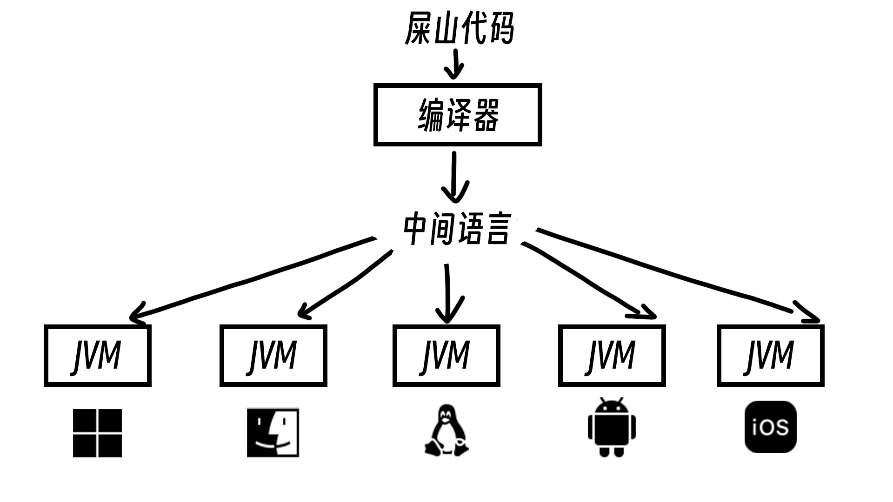
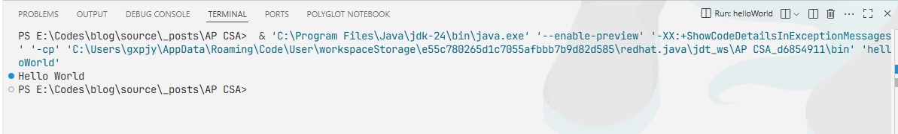

## 先介绍一些编程基础概念：

### 1. 编译

指把你写的代码转换为机器码的过程，但是我需要强调的是现在编程语言普遍分为3种，运行效率由高到低如下：

- **编译型**，指你写的代码会被完全编译成汇编语言，至于汇编是啥你不用管，你只需要知道这玩意跟000111的二进制是差不多一个级别的底层玩意就行，例如：C/C++、Rust、Go
- **半编译型**（Java所在的类型），指你写的代码会被翻译成一种中间语言，交给运行器运行，运行器看这种中间语言效率相对很高，例如：Java、C#
- **解释型**（又称脚本型），指你写的代码会被运行器一行一行看着执行，效率最低，例如：Python、JavaScript

### 2. 运行

指你的代码被实际跑在设备上的过程

### 3. 环境

代码不是能凭空编译的，后面两种类型的编程语言也不是能独立运行的，需要一个运行器或者编译器，电脑里有这种对应的东西就叫环境


## 属于Java的特殊概念

Java因为是半编译型语言，所以是跑在一个叫做 JVM (Java Virtual Machine) 的虚拟机上的，这里又有同学要问了，"虚拟机是什么"，了当的说就是一个不真实的环境，上面说了环境是装在你电脑上的，那么不直接跑在你电脑上的都叫虚拟机，Java为了能一套代码能在各种平台上运行，比如Windows电脑、Mac电脑、Linux电脑、Android手机、IOS手机，这个叫做跨平台，所以给每个设备都准备了一种虚拟机，你的代码不用变，就能直接依靠这个虚拟机跑在各个不同的设备上，结合前面的东西图示如下




*图标资源来自：[icons8](https://icons8.com/)*

接下来是 JAVA 的 两种工具类型：

- JRE (Java Runtime Environment) ，只有 JVM，没有上面的编译器，只能用来跑，没法编译，这个是给用户装的
- JDK (JAVA Development Kit)，既有 JVM 还有编译器，已经包含了 JRE 了，写代码装这个

## 配环境

接下来是装 JDK 配环境，直接看别人写好的文章就好了，我不造轮子了

- [Windows](https://developer.aliyun.com/article/1572475)
- [Mac](https://juejin.cn/post/7477926585087213604)
- <button onclick="alert('都玩Linux了还用我教吗')" 
              class="bg-primary hover:bg-secondary text-white font-medium py-3 px-8 rounded-lg transition-all duration-300 transform hover:scale-105 focus:outline-none focus:ring-2 focus:ring-primary/50 shadow-lg">
              Linux</button>

然后是你写代码的地方，你总不可能拿记事本写不是？

下载个 VS Code -\> https://code.visualstudio.com/Download

然后调中文这一步我就不教了，都要考 AP 了还调什么中文

左边 Extensions 打开，搜索 Java，然后安装第一个就行

## 写代码

点开左上角 `Files -> Open Folder` 选一个你喜欢的地方确定，然后左边上面那里把 `Explore` 打开，右键 `Explore` 的空白处 `New Java File -> Class...`，顶上会弹出来让你写文件名，把文件名敲进去回车，你应该能看到这个

```java
public class <你刚刚敲进去的文件名> {
    
}

```

在这个地方里面直接粘贴下面的代码，现在先不用管，后面的章节我会解释这个什么意思

```java
public static void main(String[] args) {
        System.out.println("Hello World");
    }
```

然后右上角点一下那个小三角▶️，不出意外你应该能看到下面大致长这样：



你看到那个 `Hello World` 就是成功了

本章节到此结束