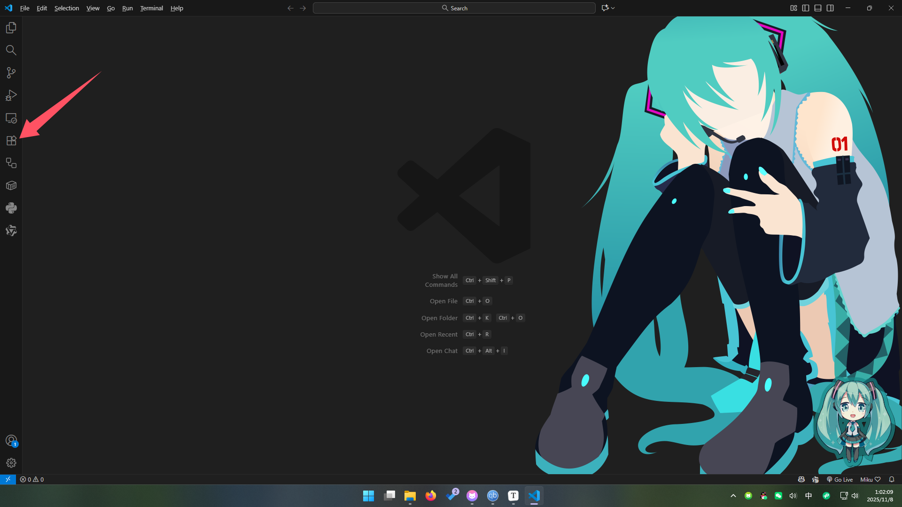
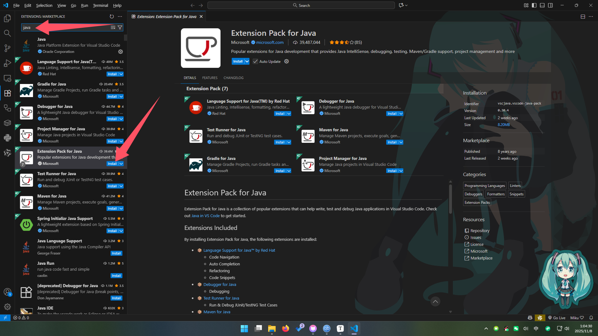
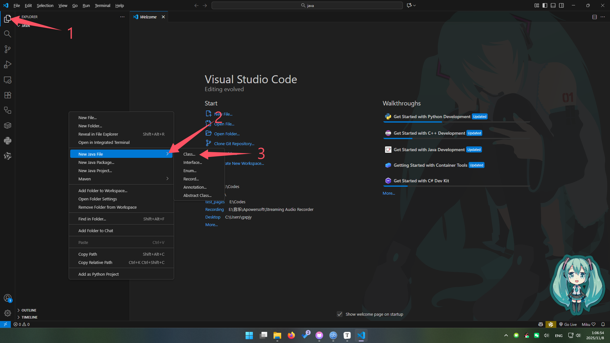
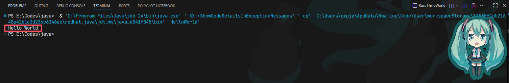

**写在前头**: 学习编程不要妄想自己什么都能一行行搞懂，所有无法理解的东西且本文我说了你不用知道的东西完全不用在乎，因为一时半会影响不了你的学习，学到后面有了一定的知识积累或者渐渐理解编程的本质之后，通过查阅文档，就能自然而然的理解那些当年不知道的内容

## 先介绍一些编程基础概念 (考试不考，但我要说)：

### 1. 编译 (Compile)

指把你写的代码转换为机器码的过程，但是我需要强调的是现在编程语言普遍分为3种，运行效率由高到低如下：

- **编译型**，指你写的代码会被完全编译成汇编语言，至于汇编是啥你不用管，你只需要知道这玩意跟000111的二进制是差不多一个级别的底层玩意就行，运行速度最快，例如：C/C++、Rust、Go
- **半编译型**（Java所在的类型），指你写的代码会被翻译成一种中间语言，交给运行器运行，运行器看这种中间语言效率相对较高，虽然运行效率低于编译型，但是会比解释型要强一点，例如：Java、C#
- **解释型**（又称脚本型），指你写的代码会被运行器一行一行看着执行，虽然有些语言会有优化，但是总的来看，还是效率最低，例如：Python、JavaScript

**「实际情况比这里说的要复杂得多，这里只是一个简化模型，帮助理解不同语言的大致类别。」**

### 2. 运行 (Run)

指你的代码被实际跑在设备上的过程

### 3. 环境 (Environment)

代码不是能凭空编译和运行的，代码是给人看的，只有机器码才是机器看的，尤其是后面两种类型的编程语言也不是能直接独立运行的，需要一个运行器或者编译器，电脑里装上这个的过程叫做配环境

## 属于Java的特殊概念

Java因为是半编译型语言，所以是跑在一个叫做 JVM (Java Virtual Machine) 的虚拟机上的，这里又有同学要问了，"虚拟机是什么"，了当的说就是一个不真实的环境，类似给你的代码套了个壳，你的代码在壳里面跑，至于壳是怎么跑在电脑上的你不用管，上面说了环境是装在你电脑上的，出来的东西是直接和电脑硬件交互，那么不直接跑在你电脑硬件上的都叫虚拟机，Java为了能一套代码能在各种平台上运行，比如Windows电脑、Mac电脑、Linux电脑、Android手机、IOS手机，这个叫做跨平台，所以给每个设备都准备了一种虚拟机，你的代码不用变，就能直接依靠这个虚拟机跑在各个不同的设备上，结合前面的东西图示如下


*图标资源来自：[icons8](https://icons8.com/)*

接下来是 JAVA 的 两种工具类型：

- JRE (Java Runtime Environment) ，只有 JVM，没有上面的编译器，只能用来跑，没法编译，这个是给用户装的
- JDK (JAVA Development Kit)，既有 JVM 还有编译器，已经包含了 JRE 了，写代码装这个

## 配环境

接下来是装 JDK 配环境，直接看别人写好的文章就好了，我不造轮子了

- [Windows](https://developer.aliyun.com/article/1572475)
- [Mac](https://juejin.cn/post/7477926585087213604)
- <a onclick="alert('都玩Linux了还用我教吗，自己查去')" >Linux</a>

然后是你写代码的地方，你总不可能拿记事本写不是？

下载个 VS Code -\> https://code.visualstudio.com/Download

然后调中文这一步我就不教了，都要考 AP 了还调什么中文，有需要的可以自行 Google 搜索

接下来为了能在 VS Code 丝滑的写 Java 代码用于练习安装 Java 插件

我们可以在这里看到一个这个Extensions图标，点开它



然后在搜索框内搜索 Java，然后根据图示安装 `Extension Pack for Java`



## 写代码



点开左上角 `Files -> Open Folder` 选一个你喜欢的地方确定，然后在左侧的导航栏打开最上面的 `Explore`，右键 `Explore` 的空白处 `New Java File -> Class...`，顶上会弹出来让你写文件名，把文件名敲进去回车，你应该能看到这个

```java
public class <你刚刚敲进去的文件名> {
    
}
```

在这个地方里面直接粘贴下面的代码，现在先不用管，后面的章节我会解释这个什么意思

```java
public static void main(String[] args) {
        System.out.println("Hello World");
    }
```

然后右上角点一下那个小三角▶️，不出意外你应该能看到下面大致长这样：



你看到那个 `Hello World` 就是成功了

## 注释 (Comments)

注释注释，顾名思义，备注释义，既然是备注就应该是给人读的不是给机器读的，所以机器看到注释会直接跳过不看，你可以在注释里面塞任何的东西，不会影响程序

注释有两种方式：
- `//` 本行后面的所有内容都会被转成注释，编译器都不看
- `/* */` 被 `/*` 和 `*/` 包裹住的内容都会变成注释，可以跨行

比如：
```Java
//这一行内后面的都会变成注释

/* 这里可以放东西
这里的内容都是注释
这里也可以写东西*/
```

## 一定一定要注意的

编程中的所有符号全部给我用英文的半角符号，不知道这是啥的就给我切成英文再写代码，或者直接把中文输入法关了，比如逗号，区分一下：`，` 这个是中文的，`,` 这个是英文的

中文的是全角符号，会比英文的宽好多，而且会圆润一点，你敲中文的编译器不认识，敲错了没看出来别说你编程是我教的

以下是容易敲错符号的列表，代码跑不起来的时候请自查符号问题：

|符号名称|中文符号|英文符号|
|-------|------|-------|
|逗号 comma|`，`|`,`|
|分号 semicolon|`；`|`;`|
|句点 period|`。`|`.`|
|小括号 curve|`（` `）`|`(` `)`|
|中括号 square bracket|`【` `】`|`[` `]`|
|大括号 bracket|`「` `」`|`{` `}`|
|感叹号 bang or shriek|`！`|`!`|
|双引号 double quotes|`“` `”`|`"` `"`|
|单引号 single quote|`‘` `’`|`'` `'`|

## 输出

这里是 AP 选择题的一个考点，有关于 Java 程序的输出

像刚刚我们在上方看到的如下代码

```Java
public static void main(String[] args) {
        System.out.println("Hello World");
    }
```

里面的

```Java
System.out.println("Hello World");
```

就是 Java 中的输出语句，它会将双引号里面的内容打印 (Print) 到你的控制台上，就像上面的图片里那样


这里我们就要引申出 AP 计算机科学一个我都不知道考了有什么意义的考点了，输出的两种语句

Java 的输出有两个语句，一个是你上面看到的 `System.out.println("Hello World");`

还有一个是下面这里的

```Java
System.out.print("Hello World");
```

它们的区别就是一个 `ln`，那么这一个 `ln` 究竟区别有多大呢？

我们用下面的例子来理解一下：

```Java
//我们先执行一下
System.out.print("Hello AP ");
//然后紧接着执行一下
System.out.println("Computer Science A");
//然后我们再接一条
System.out.println("This is an example");
```

执行之后的输出结果是这样的：

```bash
Hello AP Computer Science A
This is an example
```

我相信细节的小伙伴已经发现区别了，没错不带 `ln` 的输出后不换行，带 `ln` 的输出后会进行换行，那么接着它打印的内容就会出现在下一行

那么这里我就可以放一个我对练习题的改编题了，题目如下：

```Java
System.out.println("My Name is PLFJY");
System.out.print("I Love ");
System.out.println("AP Computer Science A");
System.out.print("Glad to ");
System.out.print("See you");
```

What is printed as a result of executing the code segment above?

A. 
My Name is PLFJY I Love 
AP Computer Science A
Glad to See you

B. 
My Name is PLFJY
I Love AP Computer Science A
Glad to See you

C. 
My Name is PLFJY
I Love AP Computer Science A
Glad to 
See you

D. 
My Name is PLFJY
I Love
AP Computer Science A
Glad to 
See you

正确答案是 B，解析：

第1行 `System.out.println("My Name is PLFJY");` 带`ln`，所以下一行换行输出，所以此时输出内容如下

```bash
My Name is PLFJY
```

第2行 `System.out.print("I Love ");` 不带 `ln`，所以下一行不换行输出，当前控制台上的内容如下

```bash
My Name is PLFJY
I Love 
```

第3行 `System.out.println("AP Computer Science A");` 带 `ln`，所以下一行换行输出，当前控制台上的内容如下

```bash
My Name is PLFJY
I Love AP Computer Science A
```

第4行 `System.out.print("Glad to ");` 不带 `ln`，所以下一行换行输出，当前控制台上的内容如下

```bash
My Name is PLFJY
I Love AP Computer Science A
Glad to
```

第5行 `System.out.println("See you");` 带 `ln`，所以下一行换行输出，但是已经是最后一句了所以没啥影响，最后控制台上的内容如下

```bash
My Name is PLFJY
I Love AP Computer Science A
Glad to See you
```

本章节到此结束
