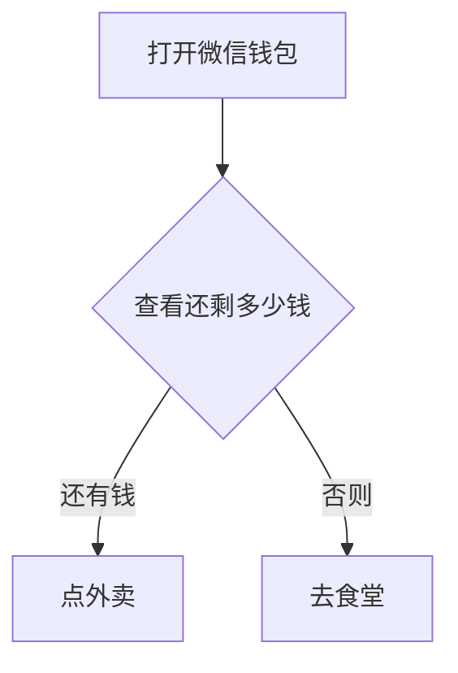
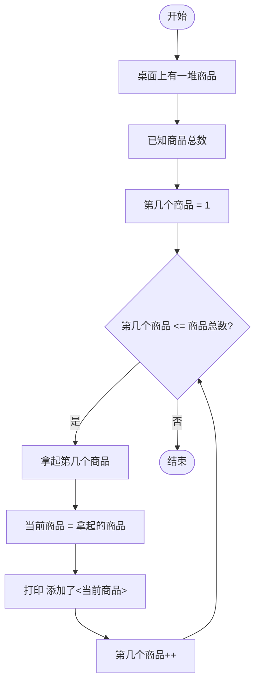
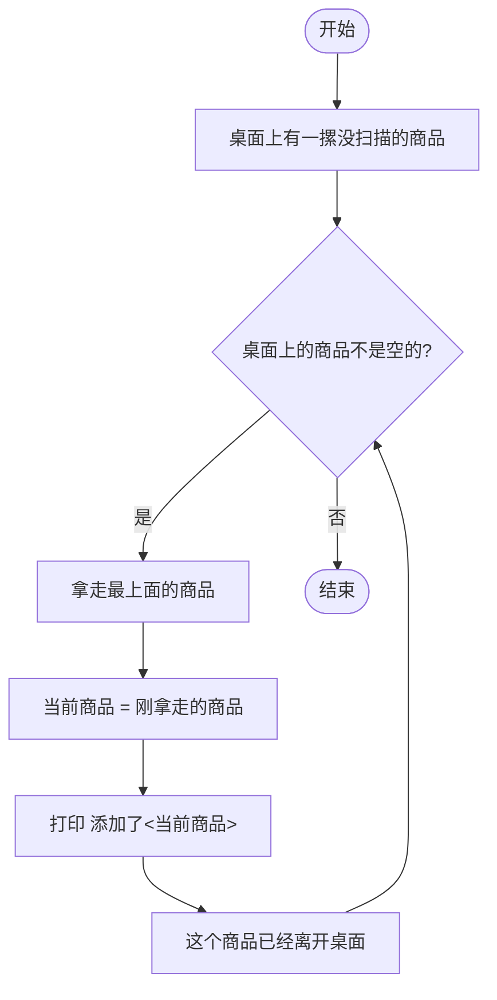

这一章讲的是程序的执行方式，程序的执行分为三种：

1. 顺序
2. 分支
3. 循环

对应的是[考试大纲](../00-about-ap-csa#考试大纲)的 2.2、2.3、2.4、2.7、2.8、2.9、3.8 的部分内容

接下来我会对于这三种执行方式依次展开说说

## 顺序 (Sequence)

顺序执行顾名思义就是根据从上到下的顺序依次执行每一行代码，就像是我在第1章提到的[输出](../01-basic-concept#输出)的样例题目那样，那种就是顺序执行，这个应该很好理解，直接过，重要的是下面两个

## 分支 (Branch)

分支结构，又称选择结构，它能够根据特定的条件判断程序该往哪里走，举一个很现实的例子

现在到了晚饭时间，你要选择去食堂还是点外卖，你就要判断一下钱够不够对吧！如果打开微信钱包，钱够，那就点外卖，否则就去食堂刷饭卡

上面这个例子就是一个很经典的分支结构的例子，那么我们该怎么写分支结构呢？

在Java中，分支结构采用的是 `if`，以及 `switch`，由于`switch` AP不考，所以我会作为补充知识来讲

首先是 `if`，我们就拿上面的例子来写一段伪代码

```java
打开微信钱包
if (还有钱)
{
    点外卖;
}
else
{
    去食堂;
}
```

写成流程图就是这样：



就是这么简单，如果点钱够就点外卖，否则就去食堂

`if` 语句中，后面的括号是判断条件，里面应该是一个 `boolean` 值，当为 `true` 的时候它就会执行 `if` 里面的内容，不满足就会执行 `else`里面的内容

`else` 是可选的，你完全可以不写，还是拿刚刚伪代码的例子，你吃完饭就得去上课，但是今天食堂没饭，所以你没钱的话就只能饿着了所以转换成伪代码是这样的：

```Java
打开微信钱包
if (还有钱)
{
    点外卖;
}
上课;
```

还有钱的话就点外卖，钱不够的话也不会执行什么特定的代码，不管你吃不吃饭你都要去上课，就是这样

---

### Boolean 表达式(基础)

那么我们来说怎么样才能是一个合格的 `boolean` 类型的判断条件

首先 boolean 的条件有几种渠道获得：
1. 比较符号：例如 `<`、`>`、`==`、`>=`、`<=`，使用方法是这样的：`值或变量 
2. boolean 变量，也就是把比较结果赋值到变量
3. 直接的 `true` 或者 `false` 表达式
4. 其它的逻辑运算符：`&&` 与、`||` 或、`!` 非，后面我会单开一章讲

总而言之，这些都能返回 `boolean` 类型结果，它们都可以作为 `if` 的判断条件

---

接下来就是一个完整的 `if` 语句的例子，这里是对应上方获取 boolean 判断条件的第一个渠道：
```Java
int age = 7;
if (age >= 7){
  System.out.println("已经上小学了");
}
else{
  System.out.println("可能还在上幼儿园");
}
```

上面的例子中，会输出 `已经上小学了`，因为判断条件是 `age >= 7`，`age` 变量在初始时设定为 7，所以 `age >= 7` 成立返回 `true`，`if` 语句就会进入第一个分支，也就是输出 `已经上小学了`

那么我们看下一个例子，这个例子是对应获取 boolean 判断条件的第二个渠道：
```Java
int age = 7;
boolean isGreaterThan7 = age >= 7;
if (isGreaterThan7){
  System.out.println("已经上小学了");
}
else{
  System.out.println("可能还在上幼儿园");
}
```

在这个例子中，我们把 `age >= 7` 的判断条件给到了一个叫做 `isGreaterThan7` 的变量，同样的，`age >= 7` 条件成立，于是 `isGreaterThan7` 的值为 `true`，那么给到 `if` 语句我们就可以顺利进入第一个分支，输出 `已经上小学了`

### 知识拓展

这部分的内容不在考纲内，不想看的可以直接跳到 [循环 (Loop)](./#loop) 的位置

#### `switch` 语句

`switch` 用于多选择分支，尤其是负责处理会获取到多种已知值的情况，比如我们有一个学校的学生，要针对不同年级的学生发放不同的奖品，那么我们可以用 `if` 这样写：

```Java
int grade = 2;
//假如该学生二年级

if (garde == 1){
    System.out.println("给一年级学生的苹果");
} else if (grade == 2){
    System.out.println("给二年级学生的栗子");
} else if (grade == 3){
    System.out.println("给三年级学生的桃子");
}
```

我们不难发现这样写挺麻烦的，于是就有了 switch 语句

```Java
int grade = 2;
//假如该学生二年级

switch (garde){
  case 1:
    System.out.println("给一年级学生的苹果");
    break; //阻挡，如果没有的话就会导致后面case 2、case 3 的内容都被执行了
  case 2:
    System.out.println("给二年级学生的栗子");
  case 3:
    System.out.println("给三年级学生的桃子");
}
```

使用这样的方式同样会输出 `给二年级学生的栗子`

这个 `break` 语句就是用来跳出这个 switch 分支的路径执行整个 switch 之后的代码

#### 三元运算符——简易版的 `if`

这是我个人非常喜欢的一个东西，我们可以举个很简单的例子，我们要判断这个人的等级是否超过某个坎来给他对应的标签。如果写成 `if` 语句就会是这样的：
```Java
int level = 10;
String tag = ""; //一会给这个人的标签
if (level > 10){
  tag = "老用户";
} else {
  tag = "新用户";
}
```

那么我们引入三元运算符的写法是怎样的呢？

```Java
int level = 10;
String tag = (level > 10) ? "老用户" : "新用户";
```

看懂了吗？

我来解析一下三元运算符的语法结构：

```Java
<判断条件> ？ <true 返回的结果> : <false 返回的结果>
```

- 判断条件：boolean 的判断条件表达式
- true 返回的结果：当判断条件表达式返回 true 执行时的结果
- false 返回的结果：当判断条件表达式返回 false 返回的结果

这一条式子需要保证被赋值的变量、返回结果 1、返回结果 2 类型一致，因为这一整条式子返回的值的类型就是返回结果 1 和返回结果 2 的类型，如果不一致，则一般情况下会执行报错

<span id="loop"/>
  
## 循环 (Loop)

循环 (loop) 结构，它是专门为了解决要重复做某件事情而诞生的，下面是一个生活化的例子：

你去超市买菜，你买了一大堆商品到达收银台，收银台的收银员要逐个拿起你放在台面上的商品扫描，这个重复 `拿起 -> 扫描 -> 放下` 的过程就是一个循环的过程

在 Java 中，循环的实现有**两种**方式，**第一种叫做 `for`** —— 次数限定循环，**第二种叫做 `while`** —— 条件限定循环，简单来说，就是你**确切的知道你要循环几次**就用 `for`，**不知道循环几次但是知道满足什么条件可以停止**就用 `while`，那么接下来我用伪代码来分别用 `for` 和 `while` 来写一下上面的例子

第一个先是用 `for` 循环的写法
```Java
一摞商品 桌面上的商品 = 一大堆商品;

for (int 第几个商品 = 1; 第几个商品 <= 商品总数; 第几个商品++) {

  物品 当前商品 = 拿起第几个商品;

  System.out.print("添加了");
  System.out.print(当前商品);

}
```

写成流程图是这样：


下面是用 `while` 循环的写法
```Java
一摞商品 桌面上的商品 = 一大堆没扫描的商品;

while (桌面上的商品 不是空的) {

  物品 当前商品 = 拿走最上面的商品;

  System.out.print("添加了");
  System.out.print(当前商品);
}
```

画成流程图长这样：


从上面的例子我们能看出，这个就是循环，重复做某个事情我们不需要把每一次都单独写出来，而是利用循环替代我们完成这个重复的工作，这也是编程最大的优势之一

---

接下来我来讲这两种循环的语法

### `for` 循环

首先是 `for` 循环，`for` 循环的定义语法如下：
```Java
for(定义循环变量; 进入条件; 每次执行完后做的事){
  你要循环的内容
}
```
下面是对各个部件详解：

- **定义循环变量**：一般是 i，如果用过了那就按照字母表顺序往下推：j、k、l，会在循环开始的时候执行一次，只能在循环里面调用，从循环语句出去之后就会被销毁无法再被调用
- **进入条件**：接受 boolean 类型，每次循环内容开始执行前都会检查，为 `true` 则进入循环，为 `false` 则退出
- **每次执行完后做的事**：一般是一个短的运算表达式，比如 `i++`、`i += 5`，每次循环内容执行结束后都会执行，为了给循环变量新的值，让循环能够结束

  
接下来是循环 20 次给 `a` 变量加 5 的例子：
```Java
int a = 0;
for (int i = 0; i < 20; i++){
  a += 5;
}
```

### `while` 循环

接下来是较为简单的 `while` 循环
```Java
while(进入条件){
  循环内容
}
```

- **进入条件**：与 for 循环一样，接受 boolean 类型，每次循环内容开始执行前都会检查，为 `true` 则进入循环，为 `false` 则退出

从上面的语法对比我们就能很明显的看出差别，while 更加适合不知道具体执行多少次的循环

下面是一个把 `a` 变量从 0 加到 100 每次加 10 的例子，我们不想算总共加几次，我们只关心有没有到 100

```Java
int a = 0
while(a < 100){
 a += 10;
}
```

## 作用域 (Scope) 

这是一个讲到分支、循环这类能嵌套的东西就不得不提的玩意

作用域 (scoop)，说直白一点就是**你这一行代码能管到的范围**，尤其对于变量来说，是这个变量**可以被访问的范围**，所以需要明确这个变量所在的 scope，不能超出该变量所在的 scope 调用该变量，否则会出现错误

一个最简单粗暴的方法判断 scope 的方法就是看**大括号**，以下我先用 `if` 语句来简单阐述一下作用域

首先我再 call back 回去一点，就是我们的代码都是包在一个大的大括号以内的，这个大括号的顶层是 class，这个 class 我会在下下章里面讲，现在粗暴的理解为下面的所有代码外面还包了一个大括号就好

```Java
int a = 10;
int b = 4;
if (a < 20) {
  b += 4;  
}
System.out.println(b);
```

这里会正常打印 8，因为在这里我们可以看到 `b` 定义在这个大的 scope 内，`if` 的执行内容也是在这个 scope 内的，所以都能访问到变量 `b` 和修改 `b` 的值，那如果我们把 `b` 的定义放到 `if` 语句的里面呢？

```Java
int a = 10;
if (a < 20) {
  int b = 4;
  b += 4;  
}
System.out.println(b);
```

这里就会报错，因为 `b` 离开了 `if` 的大括号的范围就被销毁了，你在外面根本访问不到它，这行 `System.out.println(b);` 就会报错，因为它找不到 `b` 在哪里

那么基本概念理解之后，接下来就引出了 `for` 循环当中的循环计数变量了

回顾前面的内容，`for` 循环开始前需要定义一个循环变量用于计数，这个变量是**只作用于这个 `for` 内部**的，离开了这个 `for` 就会**被销毁且无法访问**，我们来看一个错误示范：
```Java
for(int i = 0; i < 10; i++) {
  System.out.println(i);
}
System.out.println(i);
```

这里第二个的 `System.out.println(i);` 就在 for 的作用域外面，变量 `i` 就访问不到，所以就会报错

### 嵌套 `for` 循环及其应用

好的举一反三，那只要我们访问在 `for` 里面就好了是吧？这就引出了另一个点，我们也可以嵌套 `for` 循环去应用，看例子：

加入我们要打印一个 5x5 的矩阵长这样：
```Text
1   2   3   4   5
6   7   8   9   10
11  12  13  14  15
16  17  18  19  20
21  22  23  24  25
```
那我么该如何实现呢？我的思路首先是这样子的：
1. 我们需要两个 `for` 循环嵌套在一起，有点类似外层 `for` 循环进入第 x 次执行，里面的 `for` 循环执行 5 次然后退出，外层 `for` 循环执行下一次，形如这样
```Java
for(int i = 0; i < 5; i++) {
  for(int j = 0; j < 5 ; j++){
    //内容
  }
}
```
   
2. 接下来是计数器的问题，我们该如何利用好内外层循环的计数器去显示数字。我首先想到的是第一行正常显示 `j+1`
```Text
0+1 1+1 2+1 3+1 4+1
↓
1 2 3 4 5
```
  但是到了第二行之后貌似这样就不太行了，我想想，我觉得加上一个 `i * 5` 是不是就解决了，我们来验证一下：
```
第一行 i = 0，第二个数字是 j+1 的结果：
0*5+1 0*5+2 0*5+3 0*5+4 0*5+5
↓
1 2 3 4 5
第二行 i = 1，第二个数字是 j+1 的结果：
1*5+1 1*5+2 1*5+3 1*5+4 1*5+5
↓
6 7 8 9 10
第三行 i = 2，第二个数字是 j+1 的结果：
2*5+1 2*5+2 2*5+3 2*5+4 2*5+5
↓
11 12 13 14 15
```

简直完美，我们突发奇想，`j` 为什么不能从 1 开始呢？这样就不用手动 +1 了呀，我们内层循环可以写成：
```Java
for(int j = 1; j <= 5 ;j++)
```
判断条件从 `j < 5` 改成 `j <= 5`，这样我们的 `j` 就是从 1~5 了！

那么可以实现代码了：

```Java
for(int i = 0; i < 5; i++){
  for(int j = 1; j <= 5; j++){
    System.out.print(i*5+j);
    //不换行输出
  }
  System.out.println();
  //输出完一行之后换行
}
```

然后利用离开作用域之后 `i` 和 `j` 会被销毁的的特性，我们就可以看作这两个是临时变量，离开之后还能再次被定义，且不能再次被使用。

好的，这样我们就了解了循环和循环变量的基础使用

本章节到此结束