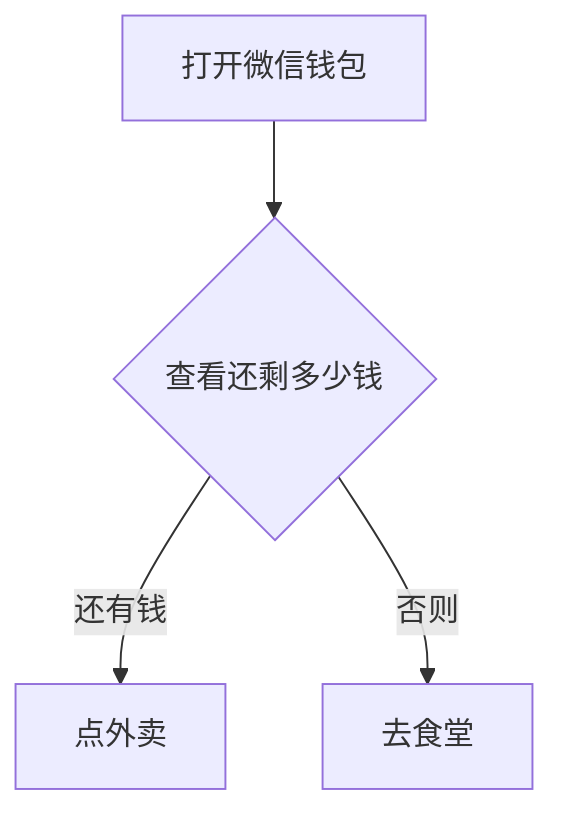

这一章讲的是程序的执行方式，程序的执行分为三种：

1. 顺序
2. 分支
3. 循环

接下来我会对于这三种执行方式依次展开说说

## 顺序 (Sequence)

顺序执行顾名思义就是根据从上到下的顺序依次执行每一行代码，就像是我在第1章提到的[输出](../01-basic-concept#输出)的样例题目那样，那种就是顺序执行，这个应该很好理解，直接过，重要的是下面两个

## 分支 (Branch)

分支结构，又称选择结构，它能够根据特定的条件判断程序该往哪里走，举一个很现实的例子

现在到了晚饭时间，你要选择去食堂还是点外卖，你就要判断一下钱够不够对吧！如果打开微信钱包，钱够，那就点外卖，否则就去食堂刷饭卡

上面这个例子就是一个很经典的分支结构的例子，那么我们该怎么写分支结构呢？

在Java中，分支结构采用的是 `if`，以及 `switch`，由于`switch` AP不考，所以我会作为补充知识来讲

首先是 `if`，我们就拿上面的例子来写一段伪代码

```java
打开微信钱包
if (还有钱)
{
    点外卖;
}
else
{
    去食堂;
}
```

写成流程图就是这样：



就是这么简单，如果点钱够就点外卖，否则就去食堂

`if` 语句中，后面的括号是判断条件，里面应该是一个 `boolean` 值，当为 `true` 的时候它就会执行 `if` 里面的内容，不满足就会执行 `else`里面的内容

`else` 是可选的，你完全可以不写，还是拿刚刚伪代码的例子，你吃完饭就得去上课，但是今天食堂没饭，所以你没钱的话就只能饿着了所以转换成伪代码是这样的：

```Java
打开微信钱包
if (还有钱)
{
    点外卖;
}
上课;
```

还有钱的话就点外卖，钱不够的话也不会执行什么特定的代码，不管你吃不吃饭你都要去上课，就是这样

那么我们来说怎么样才能是一个合格的 `boolean` 类型的判断条件
