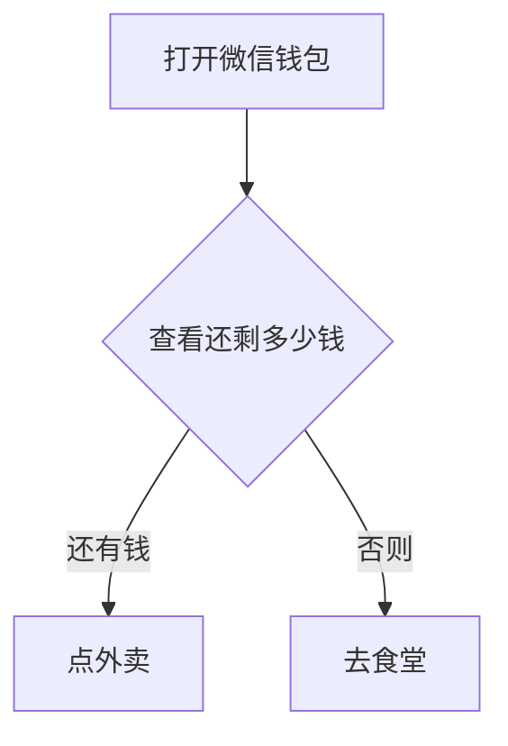
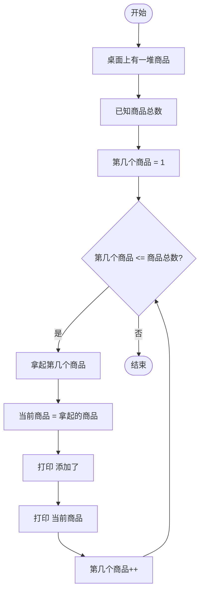
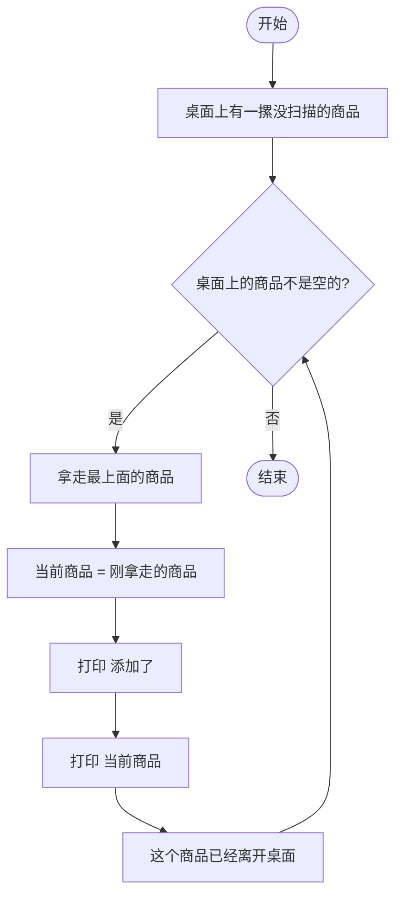

这一章讲的是程序的执行方式，程序的执行分为三种：

1. 顺序
2. 分支
3. 循环

接下来我会对于这三种执行方式依次展开说说

## 顺序 (Sequence)

顺序执行顾名思义就是根据从上到下的顺序依次执行每一行代码，就像是我在第1章提到的[输出](../01-basic-concept#输出)的样例题目那样，那种就是顺序执行，这个应该很好理解，直接过，重要的是下面两个

## 分支 (Branch)

分支结构，又称选择结构，它能够根据特定的条件判断程序该往哪里走，举一个很现实的例子

现在到了晚饭时间，你要选择去食堂还是点外卖，你就要判断一下钱够不够对吧！如果打开微信钱包，钱够，那就点外卖，否则就去食堂刷饭卡

上面这个例子就是一个很经典的分支结构的例子，那么我们该怎么写分支结构呢？

在Java中，分支结构采用的是 `if`，以及 `switch`，由于`switch` AP不考，所以我会作为补充知识来讲

首先是 `if`，我们就拿上面的例子来写一段伪代码

```java
打开微信钱包
if (还有钱)
{
    点外卖;
}
else
{
    去食堂;
}
```

写成流程图就是这样：


```mermaid
flowchart TD
    A[打开微信钱包] --> B{查看还剩多少钱}
    B -->|还有钱| C[点外卖]
    B -->|否则| D[去食堂]
```

就是这么简单，如果点钱够就点外卖，否则就去食堂

`if` 语句中，后面的括号是判断条件，里面应该是一个 `boolean` 值，当为 `true` 的时候它就会执行 `if` 里面的内容，不满足就会执行 `else`里面的内容

`else` 是可选的，你完全可以不写，还是拿刚刚伪代码的例子，你吃完饭就得去上课，但是今天食堂没饭，所以你没钱的话就只能饿着了所以转换成伪代码是这样的：

```Java
打开微信钱包
if (还有钱)
{
    点外卖;
}
上课;
```

还有钱的话就点外卖，钱不够的话也不会执行什么特定的代码，不管你吃不吃饭你都要去上课，就是这样

---

那么我们来说怎么样才能是一个合格的 `boolean` 类型的判断条件

首先 boolean 的条件有几种渠道获得：
1. 比较符号：例如 `<`、`>`、`==`、`>=`、`<=`，使用方法是这样的：`值或变量 
2. boolean 变量，也就是把比较结果赋值到变量

---

接下来就是一个完整的 `if` 语句的例子，这里是对应上方获取 boolean 判断条件的第一个渠道：
```Java
int age = 7;
if (age >= 7){
  System.out.println("已经上小学了");
}
else{
  System.out.println("可能还在上幼儿园");
}
```

上面的例子中，会输出 `已经上小学了`，因为判断条件是 `age >= 7`，`age` 变量在初始时设定为 7，所以 `age >= 7` 成立返回 `true`，`if` 语句就会进入第一个分支，也就是输出 `已经上小学了`

那么我们看下一个例子，这个例子是对应获取 boolean 判断条件的第二个渠道：
```Java
int age = 7;
boolean isGreaterThan7 = age >= 7;
if (isGreaterThan7){
  System.out.println("已经上小学了");
}
else{
  System.out.println("可能还在上幼儿园");
}
```

在这个例子中，我们把 `age >= 7` 的判断条件给到了一个叫做 `isGreaterThan7` 的变量，同样的，`age >= 7` 条件成立，于是 `isGreaterThan7` 的值为 `true`，那么给到 `if` 语句我们就可以顺利进入第一个分支，输出 `已经上小学了`

> 还有另一种分支语句叫做 `switch` 有兴趣的可以自行查找文章了解，由于 AP CSA 考试中不考，这里我就不讲了

## 循环 (Loop)

循环结构，它是专门为了解决要重复做某件事情而诞生的，接下来是一个生活化的例子：

你去超市买菜，你买了一大堆商品到达收银台，收银台的收银员要逐个拿起你放在台面上的商品扫描，这个重复拿起 -> 扫描 -> 放下的过程就是一个循环的过程

在 Java 中，循环的实现有两种方式，第一种叫做 `for` —— 次数限定循环，第二种叫做 `while` —— 条件限定循环，简单来说，就是你确切的知道你要循环几次就用 `for`，不知道循环几次但是知道满足什么条件可以停止就用 `while`，那么接下来我用伪代码来分别用 `for` 和 `while` 来写一下上面的例子

第一个先是用 `for` 循环的写法
```Java
一摞商品 桌面上的商品 = 一大堆商品;

for (int 第几个商品 = 1; 第几个商品 <= 商品总数; 第几个商品++) {

  物品 当前商品 = 拿起第几个商品;

  System.out.print("添加了");
  System.out.print(当前商品);

}
```

写成流程图是这样：

```mermaid
flowchart TD
    A([开始]) --> B[桌面上有一堆商品]
    B --> C[已知商品总数]
    C --> D[第几个商品 = 1]
    D --> E{第几个商品 &lt;= 商品总数?}

    E -- 是 --> F[拿起第几个商品]
    F --> G[当前商品 = 拿起的商品]
    G --> H[打印 添加了]
    H --> I[打印 当前商品]
    I --> J[第几个商品++]
    J --> E

    E -- 否 --> K([结束])
```

下面是用 `while` 循环的写法
```Java
一摞商品 桌面上的商品 = 一大堆没扫描的商品;

while (桌面上的商品 不是空的) {

  物品 当前商品 = 拿走最上面的商品;

  System.out.print("添加了");
  System.out.print(当前商品);
}
```

画成流程图长这样：

```mermaid
flowchart TD
    A([开始]) --> B[桌面上有一摞没扫描的商品]
    B --> C{桌面上的商品不是空的?}

    C -- 是 --> D[拿走最上面的商品]
    D --> E[当前商品 = 刚拿走的商品]
    E --> F[打印 添加了]
    F --> G[打印 当前商品]
    G --> H[这个商品已经离开桌面]
    H --> C

    C -- 否 --> I([结束])
```

从上面的例子我们能看出，这个就是循环，重复做某个事情我们不需要把每一次都单独写出来，而是利用循环替代我们完成这个重复的工作，这也是编程最大的优势之一

---

接下来我来讲这两种循环的语法

首先是 `for` 循环，`for` 循环的定义语法如下：
```Java
for(定义循环变量; 进入条件; 每次执行完后做的事){
  你要循环的内容
}
```
下面是对各个部件详解：

- **定义循环变量**：一般是 i，如果用过了那就按照字母表顺序往下推：j、k、l，会在循环开始的时候执行一次，只能在循环里面调用，从循环语句出去之后就会被销毁无法再被调用
- **进入条件**：接受 boolean 类型，每次循环内容开始执行前都会检查，为 `true` 则进入循环，为 `false` 则退出
- **每次执行完后做的事**：一般是一个短的运算表达式，比如 `i++`、`i += 5`，每次循环内容执行结束后都会执行，为了给循环变量新的值，让循环能够结束

  
接下来是循环 20 次给 `a` 变量加 5 的例子：
```Java
int a = 0;
for (int i = 0; i < 20; i++){
  a += 5;
}
```

---

接下来是较为简单的 `while` 循环
```Java
while(进入条件){
  循环内容
}
```

- **进入条件**：与 for 循环一样，接受 boolean 类型，每次循环内容开始执行前都会检查，为 `true` 则进入循环，为 `false` 则退出

从上面的语法对比我们就能很明显的看出差别，while 更加适合不知道具体执行多少次的循环

下面是一个把 `a` 变量从 0 加到 100 每次加 10 的例子，我们不想算总共加几次，我们只关心有没有到 100

```Java
int a = 0
while(a < 100){
 a += 10;
}
```

本章节到此结束