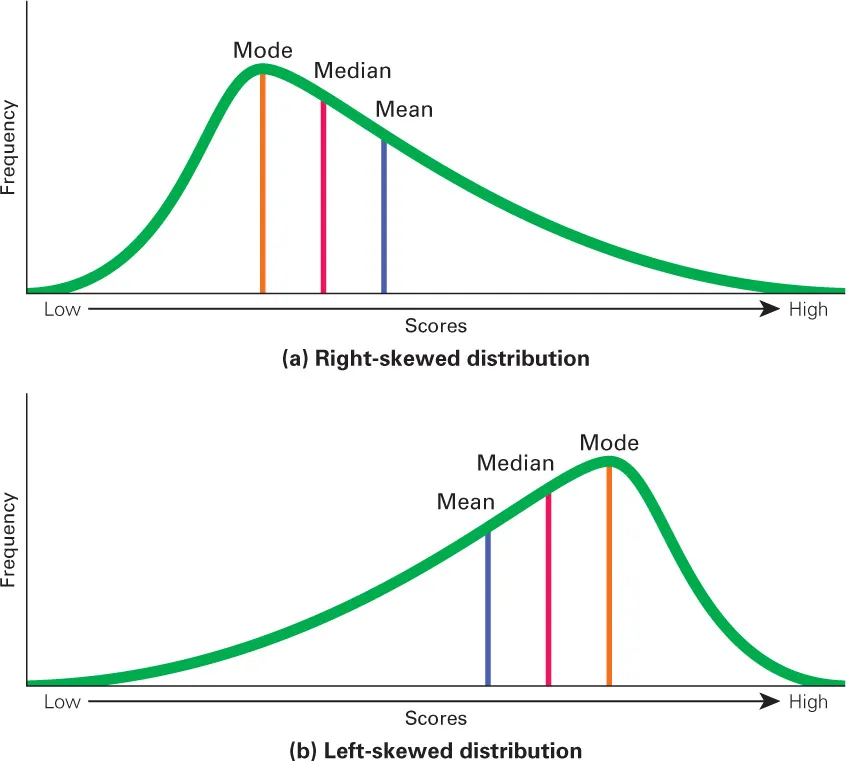

## Exam  Structure

40 MCQ + 6 FRQ

## 1.1 Data Analysis (数据的分类)

- Individual: 参与统计的个体

- variable: 一个特质（eg: gender、frequency）

- value: eg: gender里的细分比如Male、Female，frequency的细分：one time、often、 hardly

- count: 数量

### Categories of var

- Categorical Variable: `enum` `bool`

- Quantitative Variable: `int` `double`

- Distribution: Describe the condition of the data

- Population: Whole dataset

- Sample: Part of the dataset

### Analyze Variable

#### How to spot a misleading graph ?

1. missing axis labels or scale (刻度)
2. cut off x or y axis or start at a weird place
3. picture instead of a bar

#### Categorical: 
Pie chart / Bar chart / Two-way table

#### Quantitative: 
histogram / boxplot / bar chart

### Marginal distribution and Conditional distribution (Categorical Variable、Two-way table)

|          | Male | Female  | Total   |
| -------- | ---- | ------- | ------- |
| one time | num  | num `c` | num `a` |
| often    | num  | num     | num     |
| hardly   | num  | num     | num     |
| Total    | num  | num `d` | num `b` |

#### Marginal distribution: 
The proportion of count of all individuals in a variable among the total individuals (`a`/`b`) (`d` / `b`)

#### Conditional distribution: 
指定了条件(与另一个value的intersect)的values的count在指定总数中的占比，若没有指定总数，则默认为全部的总数(b)

#### Relative frequency: 
有可能是上面两个任意一个，看要求什么，不管怎么说分母都是 total

### Other graphs to describe data

[Segmented bar graph](https://cn.bing.com/images/search?q=Segmented+bar+graph&form=HDRSC2&first=1)

[Side by side bar graph](https://cn.bing.com/images/search?q=side+by+side+bar+graph&form=HDRSC2&first=1)

## 1.2 Displaying quantitative data with graphs

#### 分布 (shape)

### 描述分布 (4个维度 SCSO)

#### Shape

##### 正态分布 Normal Distribution（对称）

拱起来的在中间

##### 左偏 skew*倾斜* to the left 

左边much longer than the right

拱起来的在右边
$$
\text{mean}<\text{median}<\text{mode}
$$

##### 右偏 skew to the right

右边much longer than the left

拱起来在左边
$$
\text{mean}>\text{median}>\text{mode}
$$

*来源:[medium.com](https://medium.com/geekculture/what-are-right-skewed-and-left-skewed-distributions-a29b3def7598)*

#### Center

把整个数据分成两半

一般取 mean 或者 median

还可以叫做 typical

#### Spread 波动性

表示数据的离散程度，分散就大，聚合就小

一般用 Range 或者 [standard deviation](#Standard Deviation 标准方差)

#### Outliers 

异常值 （极大或极小）

[How to determine](#Identify outliers)

#### An example
> The data shows that the distribution is roughly symmetric.*(Reason)* Therefore it is approximately as a normal distribution.*(Shape)* The center of the data is between 227 and 252.*(Center)* The data varies from 56 to 422.*(Spread)* We do not see any observations outside the pattern of the distribution.*(Outliers)*

### Plots

Q: 选哪个图：
A: 选什么图，因为它是什么数据，什么图能更好的展示它的 distribution

#### Dot plot

#### Stem plot

记得一定要写 Key !!!!!

Key: 一个tips用来描述你展示的值represent什么东西

> eg:
> Key: 7|7 = 77 apples each day

#### Histogram

frequency histogram / relative frequency histogram (more useful)

- shows frequency
- no spaces each bar

##### Drawbacks

- no individual data just interval
- cannot find median

## 1.3 Describing Quantitative data with numbers

## Measuring Center

### Means

### Median

$Q_2$ (value at 50%)

### Mode

## Measuring Spread

### Range

maximum - minimum

### IQR (描述波动性的)

$Q_3$ (value at 75%) - $Q_1$ (value at 25%) 

#### Identify outliers:

$x < Q_1 - 1.5 \times IQR$	or	$x > Q_3 + 1.5 \times IQR$

#### Box Plot

1. number line + label
2. determine minimum, $Q_1$, $Q_2$(median), $Q_3$, and maximum
3. a line connect minimum and maximum
4. Box between $Q_1$ and $Q_3$
5. a line at $Q_2$
6. usually using median and IQR to measure the center and spread

> We only know: five values above
>
> We can't know: sample size, sample mean

### Standard Deviation 标准方差

$$
s_x>=0
$$
$$
s_x^2 = \frac{(x_1 - \bar{x})^2 + (x_2 - \bar{x})^2 + \cdots + (x_n - \bar{x})^2}{n - 1} = \frac{1}{n - 1} \sum (x_i - \bar{x})^2
$$
$$
s_x = \sqrt{\frac{1}{n - 1} \sum (x_i - \bar{x})^2} 
= \sqrt{s_x^2}
$$

s: sample variance 样本方差	VS	population variance 总体方差

Def: 数据围绕平均值的离散程度

使用条件：用mean去描述center的时候才可以用这个去描述数据的波动性

不具有抗性，可能由于outlier的影响变得更小或者更大

### Variance 方差 $>= 0$
