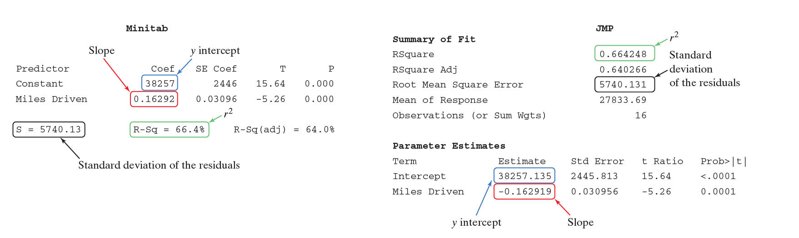

## 3.1 Scatterplots and Correlation

新的词：
自变量 --> explanatory variables => help to explain
因变量 --> response variables => measures the outcome 

### Scatterplots

relationship, two quantitative variables, same individuals

- axis
- spots

怎么描述

- overall pattern
    - direction (positive association)
    - form (linear pattern, exponential, logarithmic)
    - strength (do not very much from the linear pattern)
- 偏离该 pattern 的情况 --> outliers

> There is a strong positive relationship between duration and interval. There seems to be a linear pattern in the graph. The points do not very much from the linear pattern. There do not appear to have any outliers

## 3.2-p1 Correlation

The ==direction== and ==strength== of the linear relationship

Formula:
$$
r=\frac{1}{n-1}\sum(\frac{x_i-\bar{x}}{s_x})(\frac{y_i-\bar{y}}{s_y})
$$

$$
-1 <= r <= 1
$$

$r > 0$ => positive association 

解释 $r$ 的数值 ( $r = 0.936$ )

> There is a very strong positive association between A and B.

**Correlation does not imply causation 不能代表因果**

> A strong correlation between two variables does not mean that one caused the other.

## 3.2-p2 Least-Squares Regression

**Regression line** => a line could used to predict y according to x 用于预测
$$
\hat{y}=b_0+b_1x
$$
$\hat{y}$: predicted value from the model

解释$b_1$:

> The value y increase/decrease by $b_1$ for each additional increase in x 

解释$b_0$:

> When x equals to 0 the value y.

### Extrapolation

离回归线超远

### Residual 

$$
\text{actual} - \text{predicted}
$$

### Least-squares regression line

How to choose: let the sum of the squared residual as small as possible

一条数据组的拟合线, which let residual 平方和尽可能最小

### Residual plot 

how will the line describe the data

（在0附近）分布越均匀，说明数据越契合linear pattern

- should show no obvious pattern
- as close to 0 as possible

### Standard deviation of the residuals 

**how far** off the predictions are using the residuals 用 residuals 描述 predictions 偏移有多大
$$
s = \sqrt{\frac{\sum{residuals^2}}{n-2}} = \sqrt{\frac{\sum{(y-\hat{y})^2}}{n-2}}
$$
approximate size of "typical" or "average" predicted error

### Coefficient of Determination 决定系数

多少百分比的 y 的变动是可以被 least-squares regression line 解释的，并告诉我们这条回归线的预测结果的效果如何

#### 前置条件

$$
\text{Total sum of squares (SST)} = \sum{(\bar{y}-y)^2} \text{ (全部的y的变动)}
$$

$$
\text{Sum of squared errors (SSE)} = \sum{(y-\hat{y})^2} \text{ (没被解释到的y的变动)}
$$

要前置条件干什么：我们用SST和SSE来找到未被 least-squares regression line 解释的 y值 的变动

Formula:
$$
r^2 = 1 - \frac{SSE}{SST}
$$

> \<result\>% of the variation in the \<response variable\> is accounted for by the regression line.

### How to read output

### Calculate the regression line (using mean and standard deviation)

$$
\hat{y}=a+bx
$$

$$
b = r\frac{s_y}{s_x}
$$

$$
b=\bar{y}-b\bar{x}
$$

## ✨✨✨Put it together

- Only linear pattern could be described by correlation and regression line
- Not resistant. It can be influenced by outliers
- Switching x and y will not affect the values of r.
- Correlation does not imply causation 不能代表因果

