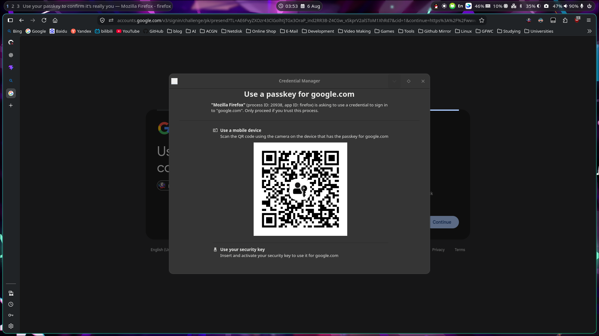

因为之前经历了微软盗号事件，最近研究出了国外平台账号安全的一个极佳解法———— Passkey + TOTP，但是问题来了，Passkey 我主要存在 iCloud KeyChain 上，一般我都是手机扫码然后 Face ID 使用的，Windows 上都没有大量存，更别说 Linux 了同时目前能找到的教程也都是怎么在 Linux 上存储 Passkey 的，没有用手机扫码使用 Passkey 的

然后问题就来了，我在 Linux 没办法在 FireFox 中使用 iPhone 扫码然后使用 Passkey，于是我就在全网寻找解决方案，结果真被我找到一个 credentialsd （https://github.com/linux-credentials/credentialsd）。但是好问题，他们这是个半成品，就是能跑肯定是能跑，但是需要装他们魔改过的 XDG Desktop Portal，这就和我的 Arch 的系统包冲突了，于是我就在想，我能不能改一下，外置一个新的 XDG Desktop Portal，避开冲突，这样代码上可以随时合并上游，本地又能以暂时方案维护一个 XDG Desktop Portal 前端的方案

说干就干，我拉上 GPT 就开始了研究，结果还真给我们研究了一套方案出来，GPT 给我的原始方案是这样的：

> ### Credential Portal Sidecar 实施计划
>
> #### 1. 项目决策
>
> 本项目不再以现有的：
>
> ```text
> feat/firefox-native-bridge
> ```
>
> 作为开发基础。
>
> 新的实现直接基于两个上游仓库：
>
> ```text
> linux-credentials/credentialsd:main
> linux-credentials/xdg-desktop-portal:credentials-portal
> ```
>
> 目标不是重新实现 Firefox WebAuthn 集成，而是：
>
> ```text
> 保留 Arch 官方 xdg-desktop-portal
> +
> 并行运行一份拥有独立 D-Bus identity 的 Credential Portal frontend
> +
> 直接使用上游 credentialsd、Firefox XPI 和手机扫码 Hybrid Passkey demo
> ```
>
> 上游 credentialsd 已提供：
>
> - Firefox 140+ WebExtension；
> - release XPI；
> - Native Messaging host；
> - `webauthn.io` 和 `demo.yubico.com` 测试；
> - Hybrid QR、手机扫码、Security Key 和 platform authenticator UI 流程。
>
> 因此，本项目只解决一个部署问题：
>
> > 如何在不替换 Arch 官方 `xdg-desktop-portal` 的情况下，运行上游尚未合并的 Credential Portal frontend。
>
> ------
>
> ### 2. 最终架构
>
> #### 2.1 系统标准 Portal
>
> 标准 Arch package 保持完全不变：
>
> ```text
> Applications
>     ↓
> org.freedesktop.portal.Desktop
>     ↓
> Arch xdg-desktop-portal
>     ↓
> xdg-desktop-portal-hyprland / GTK backend
> ```
>
> 它继续由：
>
> ```bash
> pacman -Syu
> ```
>
> 正常更新。
>
> 不得：
>
> - 替换 Arch package；
> - 覆盖其 executable；
> - 覆盖其 D-Bus activation file；
> - 覆盖其 systemd user unit；
> - 修改它的 `BusName`；
> - 给其 service 添加 Credential 实验性环境变量。
>
> ------
>
> #### 2.2 Credential Portal sidecar
>
> 新增独立 frontend：
>
> ```text
> Firefox WebExtension
>     ↓
> Native Messaging shim
>     ↓
> io.github.PLFJY.CredentialPortal
>     ↓
> Credential Portal sidecar
>     ↓
> org.freedesktop.impl.portal.experimental.Credential
>     ↓
> credentialsd
>     ↓
> credentialsd-ui
>     ↓
> Hybrid QR / USB / NFC
> ```
>
> 建议 identity：
>
> ```text
> D-Bus name:
> io.github.PLFJY.CredentialPortal
> 
> Executable:
> credentials-portal-sidecar
> 
> systemd user unit:
> credentials-portal-sidecar.service
> 
> D-Bus activation file:
> io.github.PLFJY.CredentialPortal.service
> ```
>
> 继续保留上游的：
>
> ```text
> Object path:
> /org/freedesktop/portal/desktop
> 
> Interface:
> org.freedesktop.portal.experimental.Credential
> 
> Backend interface:
> org.freedesktop.impl.portal.experimental.Credential
> ```
>
> 只修改 destination bus name，不修改 Portal protocol。
>
> ------
>
> ### 3. 为什么需要 identity patch
>
> 上游 frontend 当前硬编码拥有：
>
> ```c
> #define DESKTOP_DBUS_NAME "org.freedesktop.portal.Desktop"
> ```
>
> 并通过 `g_bus_own_name()` 获取这个名称。
>
> 它的 D-Bus activation file 也固定为：
>
> ```ini
> Name=org.freedesktop.portal.Desktop
> Exec=.../xdg-desktop-portal
> SystemdService=xdg-desktop-portal.service
> ```
>
> systemd unit 同样固定：
>
> ```ini
> BusName=org.freedesktop.portal.Desktop
> ExecStart=.../xdg-desktop-portal
> ```
>
> 因此，未经修改的 patched frontend 无法与 Arch 官方 frontend 同时运行。
>
> ------
>
> ### 4. 分支与仓库结构
>
> #### 4.1 credentialsd
>
> 基线：
>
> ```text
> linux-credentials/credentialsd:main
> ```
>
> 新的本地/个人 fork 分支：
>
> ```text
> integration/credential-portal-sidecar
> ```
>
> 必须从上游 `main` 新建，不得从旧的：
>
> ```text
> feat/firefox-native-bridge
> ```
>
> 派生。
>
> 预计只保留一个很小的修改：
>
> ```text
> 让 Native Messaging shim 的 Portal destination bus name
> 可以由 Meson build option 生成。
> ```
>
> ------
>
> #### 4.2 xdg-desktop-portal
>
> 基线：
>
> ```text
> linux-credentials/xdg-desktop-portal:credentials-portal
> ```
>
> 新的个人 fork 分支：
>
> ```text
> sidecar/credential-portal
> ```
>
> 建议始终保持为上游分支之上的一到两个 commit：
>
> ```text
> upstream credentials-portal
>     ↓
> commit 1: configurable sidecar identity
>     ↓
> commit 2: sidecar-only installation target
> ```
>
> 不要在这个分支中修改 Credential protocol 或其他 Portal 行为。
>
> ------
>
> ### 6. 非目标
>
> 第一版明确不做：
>
> - 不重写 Native Messaging shim 为 Rust；
> - 不修改 credentialsd Gateway；
> - 不重写 WebExtension；
> - 不扩展支持的网站；
> - 不重新设计 AbortSignal；
> - 不实现 Credential-only frontend；
> - 不提交 AUR；
> - 不向 AMO 提交新的 XPI；
> - 不维护自定义 Firefox；
> - 不替换 `xdg-desktop-portal-hyprland`；
> - 不替换 Arch 官方 `xdg-desktop-portal`；
> - 不追求生产级多 tab、取消和崩溃恢复。
>
> 第一阶段的唯一功能目标是：
>
> ```text
> Firefox
> → webauthn.io
> → credentialsd UI
> → 显示 Hybrid QR
> → 手机扫码
> → 成功创建和使用 Passkey
> ```

删减了一些，凑合着看吧，然后就是交给 GLM 5.2 执行了，最终效果非常好：



日用的话问题应该是不大了

仓库是这俩：

https://github.com/PLFJY/credentialsd

https://github.com/PLFJY/xdg-desktop-portal

---

## 部署 (Arch)

Arch 用户部署就是这样子：

首先，先下 PKGBUILD：

```bash
mkdir credentialsd-firefox-sidecar-git
cd credentialsd-firefox-sidecar-git
curl -L -O https://raw.githubusercontent.com/PLFJY/credentialsd/integration/credential-portal-sidecar/packaging/credentialsd-firefox-sidecar-git/PKGBUILD
```

然后，开始构建并安装：

```bash
makepkg -si
```

接着安装一下 Firefox 的扩展：

https://github.com/PLFJY/credentialsd/releases/latest

就是这样

---

其余发行版的话部署的话就是这样子（这是 AI 写的通用部署文档）：

## Credential Portal Sidecar 部署指南（通用）

本文档描述如何在 Arch Linux 上部署 Firefox Hybrid QR Passkey 方案。该方案与
桌面环境无关，支持 GNOME、KDE Plasma、Hyprland、sway 等任何具备可用图形
D-Bus 会话与 systemd 用户服务的桌面环境。

### 架构

```
Firefox WebExtension → Native Messaging shim → io.github.PLFJY.CredentialPortal (sidecar)
→ Credential Portal frontend → credentialsd daemon/UI → Hybrid QR → 手机 Passkey
```

系统级 `org.freedesktop.portal.Desktop` 及其各桌面自带的后端配置不受影响。

### 前置条件

- Arch Linux
- Firefox 140+ (原生包，非 Snap/Flatpak)
- 具有用户 D-Bus 与 systemd 用户服务的图形桌面会话（GNOME、KDE Plasma、Hyprland、sway 等均可；Hyprland 仅为已测试环境之一，非架构要求）
- Rust toolchain (stable)
- meson >= 1.5, ninja, pkg-config

### 依赖安装

```sh
sudo pacman -S --needed rust cargo meson ninja gtk4 dbus python-dbus-next \
  libwebauthn hidapi systemd libdex json-glib glib2 pipewire geoclue \
  gdk-pixbuf2 python-pytest python-dbusmock
```

### 构建与安装

#### 1. xdg-desktop-portal (sidecar 前端)

```sh
cd xdg-desktop-portal
meson setup --prefix=/usr \
  -Dsidecar_install=true \
  -Dportal_bus_name=io.github.PLFJY.CredentialPortal \
  -Dportal_binary_name=credentials-portal-sidecar \
  -Dportal_systemd_unit_name=credentials-portal-sidecar.service \
  -Dportal_dbus_service_name=io.github.PLFJY.CredentialPortal.service \
  build
ninja -C build
sudo ninja -C build install
```

#### 2. credentialsd (守护进程 + UI + 扩展)

```sh
cd credentialsd-sidecar
meson setup --prefix=/usr \
  -Dprofile=default \
  -Dfirefox_portal_bus_name=io.github.PLFJY.CredentialPortal \
  -Dcargo_locked=true \
  build
ninja -C build
sudo ninja -C build install
```

### 配置

#### Portal 后端选择（桌面环境无关）

后端选择不依赖用户的真实桌面环境。Credential Portal sidecar 通过自身独立的
桌面标识 `credentials-sidecar` 进行后端选择，与系统级
`org.freedesktop.portal.Desktop` 完全隔离。

具体机制：

1. sidecar 的 systemd 用户单元通过 drop-in
   `/usr/lib/systemd/user/credentials-portal-sidecar.service.d/credentials-sidecar.conf`
   仅覆盖 sidecar 进程自身的环境：

   ```ini
   [Service]
   Environment=XDG_CURRENT_DESKTOP=credentials-sidecar
   Environment=XDG_DESKTOP_PORTAL_ENABLE_EXPERIMENTAL=credential
   ```

   该 override 只影响 sidecar 进程，不修改标准 `xdg-desktop-portal.service`，
   也不触碰用户真实的桌面会话环境或全局 `XDG_CURRENT_DESKTOP`。

2. 与之配套的前端配置
   `/usr/share/xdg-desktop-portal/credentials-sidecar-portals.conf`
   （文件名与 `XDG_CURRENT_DESKTOP` 的小写值一致）只对 sidecar 生效：

   ```ini
   [preferred]
   default=none
   org.freedesktop.impl.portal.experimental.Credential=credentialsd
   ```

   除 Credential 接口外，其余后端接口在 sidecar 中均解析为 `none`。

3. `credentialsd.portal` 的 `UseIn=credentials-sidecar;` 仅作为遗留兜底，
   不再枚举任何真实桌面环境（如 GNOME/KDE/Hyprland/sway）。

正常情况下**无需**用户创建 `~/.config/xdg-desktop-portal/portals.conf`。该方案
不会安装或修改任何桌面自带的 `gnome-portals.conf`、`kde-portals.conf`、
`hyprland-portals.conf` 或通用 `portals.conf`，也不会写入用户家目录。

标准 Portal 仍然使用用户真实的 `XDG_CURRENT_DESKTOP` 及其桌面自带配置，
FileChooser、ScreenCast、Screenshot、Settings、OpenURI、RemoteDesktop、
GlobalShortcuts 等接口的后端选择不受影响。

#### App ID

shim 中的 `APP_ID` 已在构建时通过 meson 配置为 `firefox`（对应 `/usr/share/applications/firefox.desktop`）。

#### Trusted Caller

credentialsd 守护进程验证调用者 PID 的可执行文件路径。`/usr/lib/credentials-portal-sidecar` 已在 `credentialsd/src/gateway/mod.rs` 的 trusted_caller_paths 中。

### 启动服务

```sh
systemctl --user daemon-reload
systemctl --user start credentials-portal-sidecar.service
systemctl --user start xyz.iinuwa.credentialsd.UiControl.service
```

credentialsd 守护进程 (`xyz.iinuwa.credentialsd.Credentials.service`) 会在首次请求时由 D-Bus 自动激活。

### 加载 Firefox 扩展

#### 正式安装（用户）

正式安装使用 Mozilla AMO 未上架签名（unlisted）的 XPI，该 XPI 仅通过 GitHub Releases 分发：

1. 下载最新 Release 的签名 XPI：
   `https://github.com/PLFJY/credentialsd/releases/latest`
2. Firefox → `about:addons`
3. 齿轮菜单 → **Install Add-on From File…**
4. 选择下载的签名 XPI

`makepkg -si` 不会安装 Firefox 扩展，只安装 Linux 端的原生集成。

#### 临时加载（仅开发用）

仅用于开发/测试。Meson 构建会在构建目录生成未签名的 XPI，可临时加载；该 XPI 不会安装到 `/usr`，Firefox 重启后失效。

1. 构建：`ninja -C build`
2. 定位未签名 XPI（典型路径）：`build/webext/add-on/credentialsd-firefox-helper.xpi`
3. Firefox → `about:debugging#/runtime/this-firefox`
4. 点击 "Load Temporary Add-on..."
5. 选择构建目录中的未签名 XPI

未签名 XPI 不得用于正式安装，也不会出现在 GitHub Release 中。

### 维护者设置

要发布 Firefox 扩展，维护者需要：

- Mozilla 开发者账号（https://addons.mozilla.org/developers/）
- AMO API 凭据（JWT Issuer + JWT Secret），从 AMO Developer Hub 申请
- GitHub Environment：`amo-signing`
  - Environment Secret：`AMO_JWT_ISSUER`
  - Environment Secret：`AMO_JWT_SECRET`
- 可选：为 `amo-signing` 环境配置 required reviewer

凭据值不得提交到仓库、写入工作流命令文本、打印到日志、发送到 artifacts，或暴露给 pull request。工作流仅通过步骤环境变量读取：

```yaml
env:
  AMO_JWT_ISSUER: ${{ secrets.AMO_JWT_ISSUER }}
  AMO_JWT_SECRET: ${{ secrets.AMO_JWT_SECRET }}
```

示例凭据值不得出现在仓库中。

### 发布 Firefox 版本

1. 更新 `webext/add-on/manifest.firefox.json` 中的 `version`
2. 本地校验：
   ```sh
   python3 scripts/prepare-firefox-extension.py /tmp/credentialsd-ext-prep
   python3 tests/test_release_manifest_invariants.py
   python3 tests/test_release_id_consistency.py
   python3 tests/test_prepare_extension.py /tmp/credentialsd-ext-prep
   python3 tests/test_update_manifest_generator.py
   python3 tests/test_packaging_policy.py
   python3 tests/test_workflow_security.py
   python3 tests/test_release_no_secrets.py
   python3 tests/test_release_retired_ids.py
   python3 tests/test_signed_xpi_structure.py
   ```
3. 将改动合并到默认分支
4. 打开 GitHub Actions
5. 选择 **Release Firefox Extension** workflow
6. 设置 `publish=true` 触发发布
7. 审批 `amo-signing` Environment 部署（如配置了 required reviewer）
8. 等待 AMO 签名完成
9. 校验 GitHub Release：tag `firefox-v<VERSION>`，包含 4 个资产：
   - `credentialsd-sidecar-firefox-<VERSION>.xpi`（Mozilla 签名的新 XPI）
   - `updates.json`
   - `SHA256SUMS`
   - `release-metadata.json`
10. 下载签名 XPI 安装到 Firefox，在 https://webauthn.io 测试 create/get

工作流不会在 push、pull request 或任意 tag 上自动发布。每次发布都使用新版本号，不得复用已存在的 AMO 版本或 Git tag。

### 自动更新

Firefox 通过扩展 manifest 中声明的 `update_url` 周期性拉取更新清单：

```
https://github.com/PLFJY/credentialsd/releases/latest/download/updates.json
```

`updates.json` 中的 `update_link` 使用精确版本化的 Release 资产 URL：

```
https://github.com/PLFJY/credentialsd/releases/download/firefox-v<VERSION>/credentialsd-sidecar-firefox-<VERSION>.xpi
```

只有 `updates.json` 这个 URL 是 `releases/latest` 形式；XPI 本身始终指向精确版本。

Firefox 更新 Release 必须是普通 Release：

- 不是 draft
- 不是 prerelease

否则 Firefox 不会从 `updates.json` 拉取到该版本。

### 用户安装

1. Clone `PLFJY/credentialsd`
2. 进入 `packaging/credentialsd-firefox-sidecar-git`
3. 运行 `makepkg -si`
4. 重启/启动 user services
5. 从最新 GitHub Release 下载 Mozilla 签名的 XPI
6. 打开 `about:addons`
7. 选择 **Install Add-on From File…**
8. 选择下载的签名 XPI
9. 在 https://webauthn.io 测试 create/get

`makepkg -si` 不会安装 Firefox 扩展，只安装 Linux 端的原生集成。

### 开发者临时加载

未签名构建产物仅用于开发：

- 仅开发使用
- 通过 `about:debugging` 临时加载
- Firefox 重启后失效
- 不会安装到 `/usr`

临时加载说明不得与正式用户安装说明混用。

### 验证

```sh
# 检查 sidecar 是否运行
systemctl --user status credentials-portal-sidecar.service

# 检查 Credential 接口是否注册
gdbus introspect --session --dest io.github.PLFJY.CredentialPortal \
  --object-path /org/freedesktop/portal/desktop 2>&1 | grep credential

# 检查 credentialsd-ui 是否运行
systemctl --user status xyz.iinuwa.credentialsd.UiControl.service

# 测试 Passkey
# 打开 https://webauthn.io → Register → 扫码完成
```

### 网站覆盖范围

扩展 manifest 的 content_scripts 匹配 `https://*/*`，支持所有 HTTPS 网站。origin 验证由 credentialsd 守护进程执行，不依赖扩展的 matches。

### 修改的源文件

| 文件 | 改动 |
|------|------|
| `credentialsd/src/gateway/mod.rs` | 添加 `/usr/lib/credentials-portal-sidecar` 到 trusted_caller_paths |
| `webext/app/meson.build` | APP_ID 从 `org.mozilla.firefox` 改为 `firefox` |
| `webext/add-on/manifest.firefox.json` | matches 从特定网站改为 `https://*/*` |
| `portal/credentialsd.portal` | `UseIn` 改为 `credentials-sidecar;`（仅遗留兜底，不再枚举真实桌面） |
| `portal/credentials-sidecar-portals.conf` | 新增 sidecar 专用前端配置（`default=none` + Credential=credentialsd） |
| `systemd/credentials-portal-sidecar.service.d/credentials-sidecar.conf` | 新增 sidecar 单元 drop-in，仅覆盖 sidecar 自身 `XDG_CURRENT_DESKTOP=credentials-sidecar` |
| `meson.options` | 新增 `firefox_portal_bus_name` 选项 |
| `xdg-desktop-portal` meson 选项 | 新增 sidecar 安装支持 |

### 上游同步

1. 拉取上游更改
2. 冲突概率低 — 所有改动都是新增 option/路径，不修改既有逻辑
3. 同步后重新构建安装即可

### 清理

```sh
# 清理构建目录
rm -rf credentialsd-sidecar/build xdg-desktop-portal/build

# 清理临时文件
rm -f /tmp/credential_manager_shim.log
rm -rf /tmp/credentialsd-ext
```

### 排障

#### Credential 接口未注册

检查 sidecar 是否使用独立桌面标识 `credentials-sidecar`（应由 drop-in 覆盖，
不依赖真实桌面）：

```sh
systemctl --user show credentials-portal-sidecar.service -p Environment
# 应包含 XDG_CURRENT_DESKTOP=credentials-sidecar
# 以及 XDG_DESKTOP_PORTAL_ENABLE_EXPERIMENTAL=credential
```

检查 sidecar 专用前端配置是否存在且只选择 Credential：

```sh
cat /usr/share/xdg-desktop-portal/credentials-sidecar-portals.conf
cat /usr/share/xdg-desktop-portal/portals/credentialsd.portal
# credentialsd.portal 的 UseIn 应为 credentials-sidecar;（不再是 Hyprland;）
```

#### SecurityError: no description

检查 credentialsd 日志：

```sh
journalctl --user -u xyz.iinuwa.credentialsd.Credentials.service --no-pager -n 10
```

如果显示 "untrusted caller"，确认 `/usr/lib/credentials-portal-sidecar` 在 trusted_caller_paths 中。

如果显示 "claimed_app_id 为空"，确认 shim 中的 APP_ID 是 `firefox`（不是 `org.mozilla.firefox`）。

#### Native Messaging 连接失败

确认 manifest 存在且扩展 ID 匹配：

```sh
cat /usr/lib/mozilla/native-messaging-hosts/xyz.iinuwa.credentialsd_helper.json
```

确认 `allowed_extensions` 包含 `credentialsd-sidecar@plfjy.top`。