今天突然心血来潮 Vibe Coding 了一个纯 Workers 的 Hexo 博客管理后台，主要还是基于 GitHub API 完成

仓库是 [PLFJY/hexo-blog-admin](https://github.com/PLFJY/hexo-blog-admin)

后续功能上可能还会带来一些更新，也许还会支持许多主题特定功能或博客配置的修改

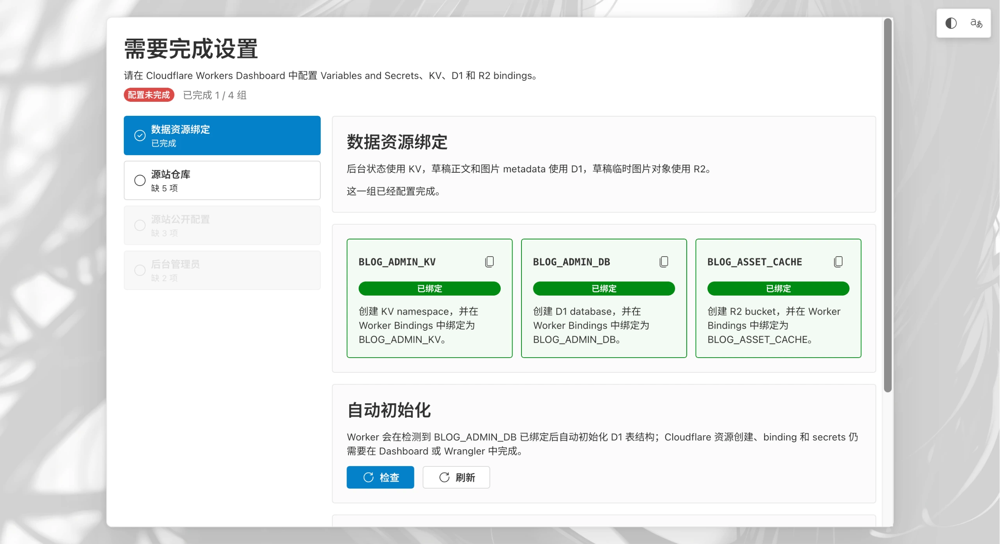

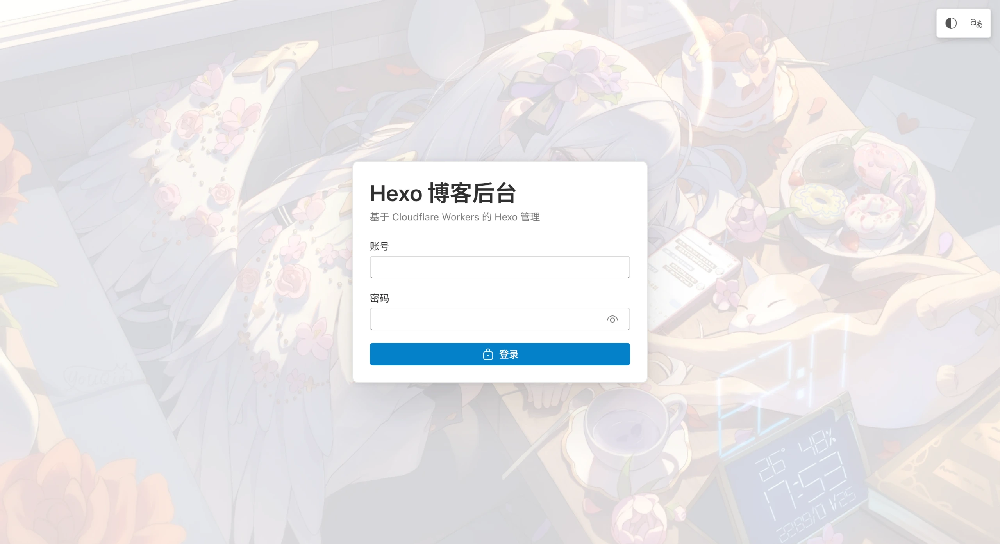

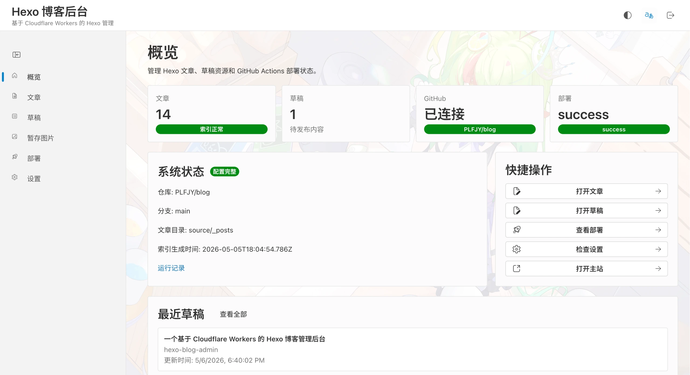

---

## 前言

基于 Hexo 的博客传统上会直接使用 Git 仓库的管理方式，略微有些高阶者可能尝试过 Hexo admin 之类的面板，但是至少我的体验上还是挺差的，至少我的图片没有被正确加载出来，至少在官方的教程下的传统资源文件方式解析就是有问题的，于是 Hexo admin 基于官方错误的解析方式解析，根本没法对[hexo-asset-img](https://github.com/yiyungent/hexo-asset-img) 这种插件做很好的适配，并且对于诸如 `==高亮==` 的==高亮==扩展语法、$x+y=0$ 的 LaTex 公式也咩有很好的支持。扯远了，对于其它类型的管理面板，例如 Decamp 的泛用型 CMS 管理面板也并不是很完美的适配 GitHub Action 构建 + Cloudflare Pages 部署的环境，于是我灵机一动直接用 Codex 搓了一个。

> 插个锚点，我解决图片问题是看的这篇文章，有兴趣可以去看看：[解决静态图片路径错误问题](https://tech.yemengstar.com/hexo-tutorial-postandimages-beginner/)

此面板基于 React 19 和 Fluent UI，配上一些小巧思便诞生了这个作品。采用纯 Cloudflare 的方案，完美适配一切基于 GitHub 搭建的 Hexo 博客站。正文存放于 GitHub仓库，通过 Action 直接部署至 GitHub Pages、Cloudflare Pages 或者 Vercel，草稿存放在 Cloudflare 的 D1 存储库当中，草稿当中上传的图片存放在 Cloudflare 的 R2 存储桶里，会在部署时随着文章一起打包上传至仓库内，运行时的配置采用 KV 存储，配置项通过 Workers Variable 环境变量配置。同时需要依赖源站做一个小改动，加一个小脚本生成一个 `admin-index.json` 方便面板获取博客站点上的信息

## 特色功能

### 1. 零成本部署
完全依托于 Cloudflare 的免费方案，无需服务器，但可能 R2 和 D1 需要 CF 绑定信用卡才能开通

Git 操作利用 GitHub API完成

### 2. 文章管理

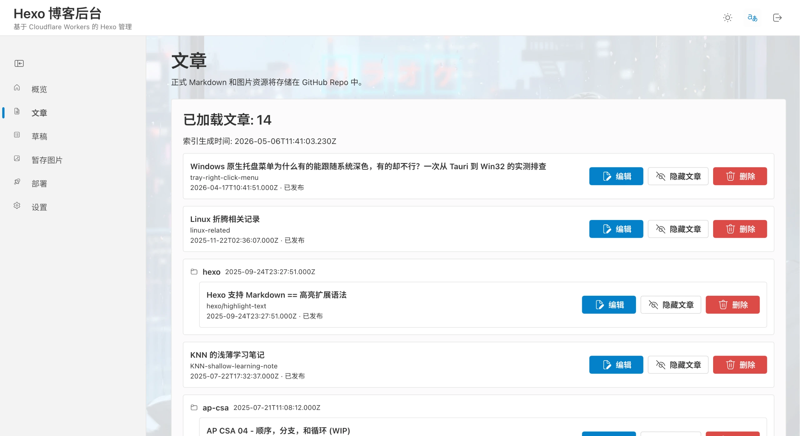

对于博客已有的文章，可以在文章页面进行管理，实行编辑、切换发布状态、删除的动作，且后两个操作都有二次确认

### 3. 文章编辑

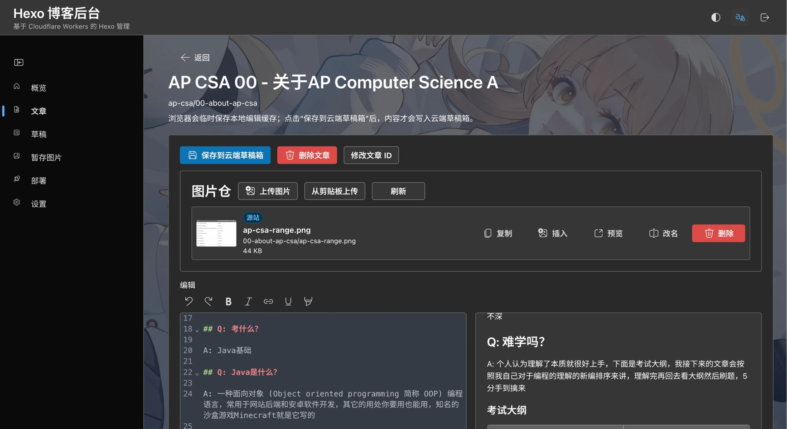

~~不要问我为啥一下从浅色变成了深色，因为天黑了~~

对于每一篇文章，都有独立的编辑页，和完整的Markdown编辑器，支持直接 Ctrl+V 插入图片，如果插入的图片过大则会弹出提示是否进行压缩

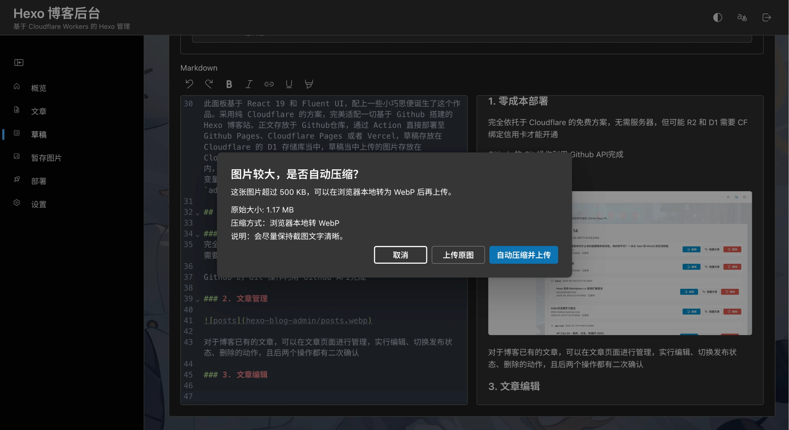

压缩过程全程在浏览器本地运行，完成后自动上传到 R2 存储桶当中缓存，所以，不同于源站已经有的图片，这里上传的图片会有“暂存”的标识

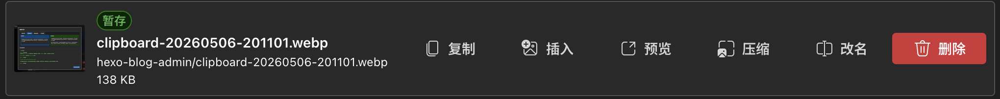

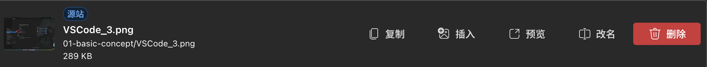

对于已经上传的图片，可以执行复制、插入、预览、改名、删除的操作，其中，改名和删除会有二次确认，对源站的图片操作时会立即生成删除该图片行为的 commit 并推送到 Github 仓库，预览区也可以对图片进行正确的渲染，如若遇到问题，欢迎来仓库提 issue 或拉 PR

在文章页面直接编辑的源站文章会需要先存入草稿箱才能从草稿箱点击发布，这个是特性不是 BUG

### 4. 草稿管理

文章编辑时会实时在本地产生缓存，以便在刷新后立刻得到进度同步，所以同设备下你大可直接离开编辑界面而不用担心保存问题，不过更稳妥的是点击手动保存并存入草稿箱

细心的朋友应该发现了，如果本地和草稿箱产生了冲突怎么办？比如我在电脑有份草稿，但是我又在手机编辑了内容并推送至了草稿箱，那么则会出现冲突提示，在这个窗口内，你可以选择使用使用云端 / 保留本地

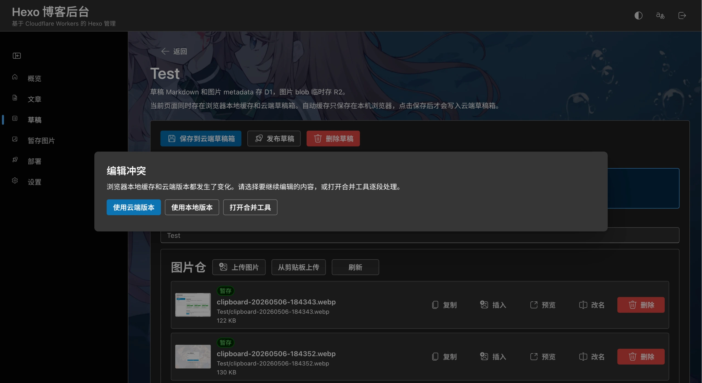

当然，也可以手动解决冲突

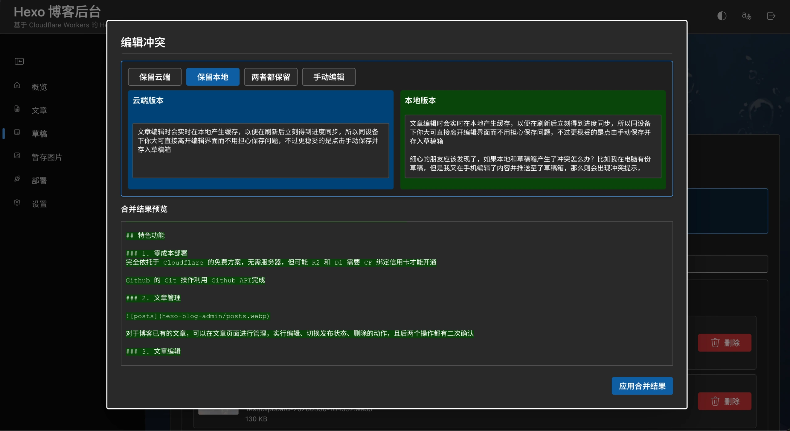

#### 5. 暂存图片管理

这里通常不需要手动管理，因为暂存的图片会在文章发布后 / 草稿删除后自动删除，主要起到的是后备隐藏能源的作用

#### 6. 站点部署

这里可以手动触发 GitHub 的 部署 Action，强制同步仓库状态，不过如果 Action 的触发是通过 on push 的话这里主要还是起到一个看一眼上次部署状态的作用

#### 7. 设置

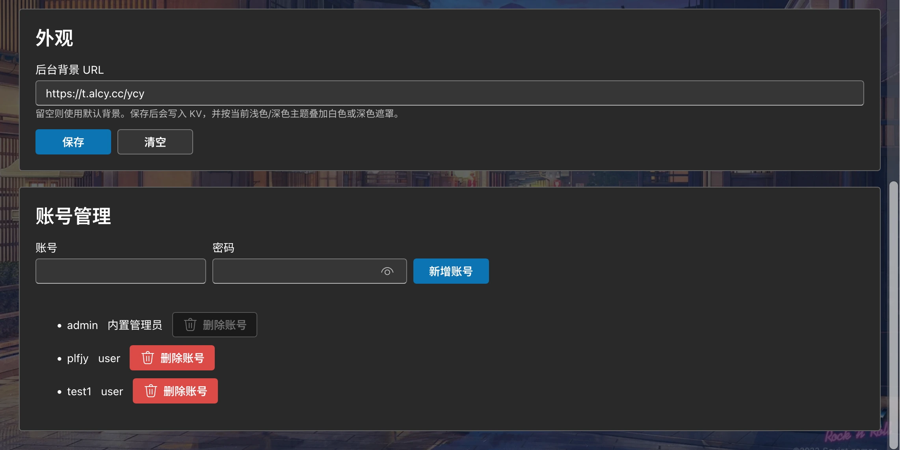

剩下就是可以设置一些背景图片、登录账号什么的了，就没什么特别的了

---

### 面板部署教程

接下来就是部署教程

首先打开仓库 [PLFJY/hexo-blog-admin](https://github.com/PLFJY/hexo-blog-admin/fork) 把仓库 Fork 下来

根据 README 当中的说明配置 [用于源博客站的 admin-index.json](https://github.com/PLFJY/hexo-blog-admin#%E5%8D%9A%E5%AE%A2%E4%BB%93%E5%BA%93%E4%BE%A7%E9%85%8D%E7%BD%AE-admin-indexjson)

接下来来到 Cloudflare，创建 Workers 应用程序，选择刚刚 Fork 下来的仓库创建

接下来去 Workers 设置中配置域名

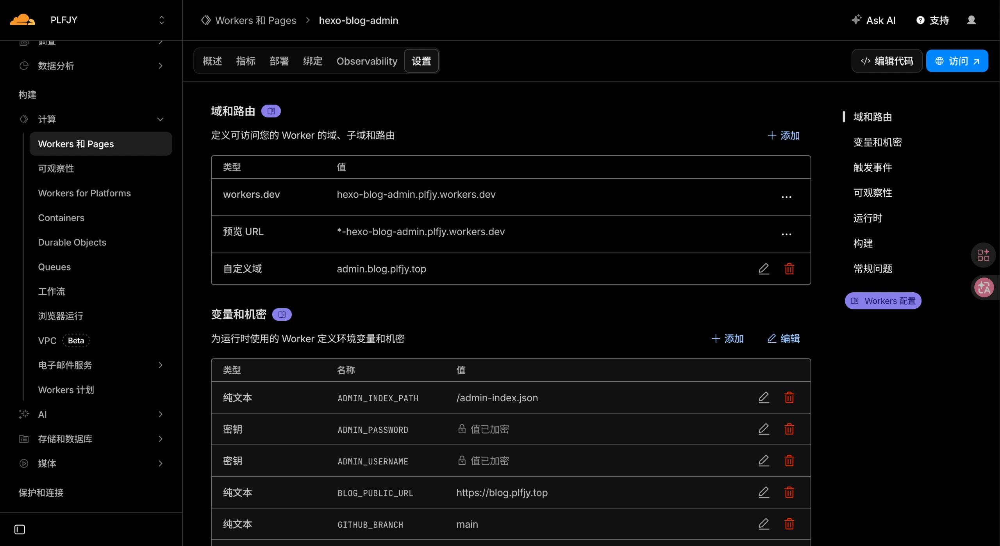

接着进入后台并根据向导设置环境变量和绑定三种存储介质的命名空间

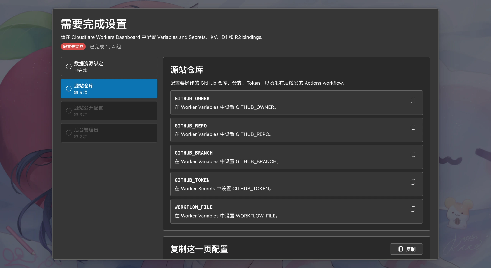

其中，GitHub 的 Token (GITHUB_TOKEN)设置跟着下面的步骤走：

1. 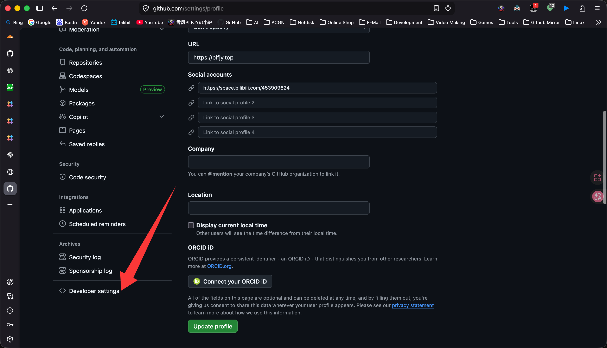

2. 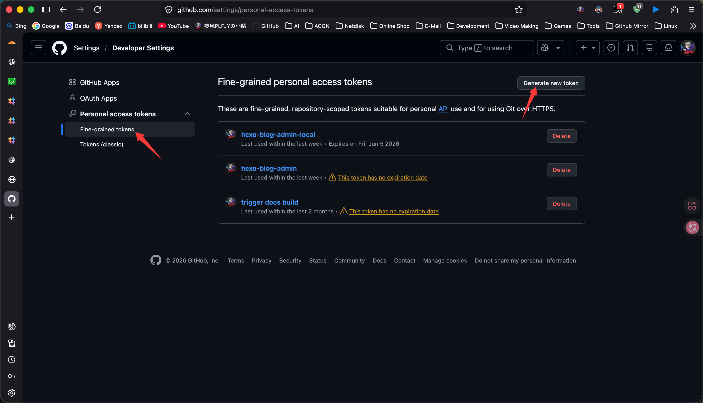

3. 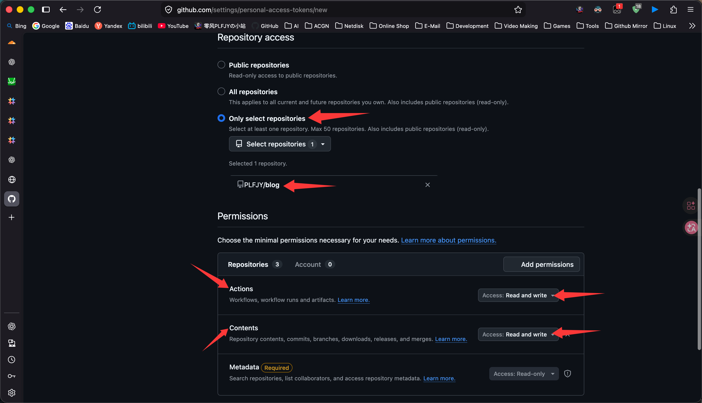

然后得到的 Token 以密钥的形式放入 Workers 中的环境变量即可

一切大功告成后，Enjoy!

欢迎各位积极提出 issue 和 PR