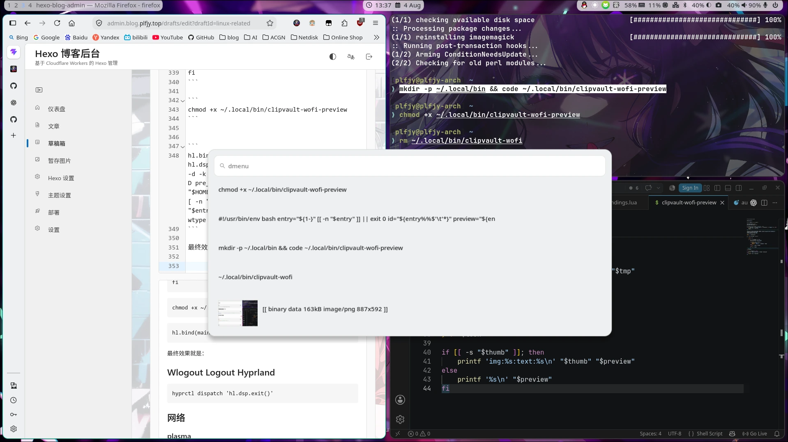

折腾了这么久linux，好多小问题，每解决一个我都扔进来一个，虽然可能只有我自己看的懂，就当随笔记录吧，我时不时可能会拿一些出来单独写点文章啥的

很有可能这里面能翻到你可能也会遇到的问题，我的环境是这样的：

```
                  -`                 plfjy@plfjy-arch
                 .o+`                ────────────────
                `ooo/                ┌ OS        → Arch Linux x86_64
               `+oooo:               │ Host      → ASUS S501ME_S502ME (1.0)
              `+oooooo:              │ Kernel    → Linux 7.1.5-arch1-2
              -+oooooo+:             │ Packages  → 1 (linglong), 1607 (pacman)
            `/:-:++oooo+:            │ Shell     → zsh 5.9.2
           `/++++/+++++++:           │ Dsiplay   → 1920x1080 in 24", 180 Hz [External]
          `/++++++++++++++:          │ WM / DE   → Hyprland 0.56.1 (Wayland) / Plasma 6
         `/+++ooooooooooooo/`        │ Theme     → Breeze-Dark [GTK2/3/4]
        ./ooosssso++osssssso+`       │ Icons     → breeze [GTK2/3/4]
       .oossssso-````/ossssss+`      │ Font      → NotoSans Nerd Font (10pt) [GTK2/3/4]
      -osssssso.      :ssssssso.     │ Terminal  → ghostty 0.0.0-20260731.r16748.g4d605bf.aur-ghostty-nightly-bin
     :osssssss/        osssso+++.    │ CPU       → 13th Gen Intel(R) Core(TM) i5-13400F (16) @ 4.60 GHz
    /ossssssss/        +ssssooo/-    │ GPU       → NVIDIA GeForce RTX 3060 Lite Hash Rate [Discrete]
  `/ossssso+/:-        -:/+osssso+-  │ Memory    → 6.66 GiB / 15.28 GiB (44%)
 `+sso+:-`                 `.-/+oso: │ Swap      → 647.70 MiB / 16.00 GiB (4%)
`++:.                           `-/+/│ Disk      → 151.22 GiB / 252.75 GiB (60%) - ext4
.`                                 `/└ Locale    → en_US.UTF-8
```

## 修复 Linux 中的一个噪音问题（Intel 必备）：
https://cyril3.github.io/2020/05/17/fix-linux-popup-noise

```
sudo vim /etc/modprobe.d/disable_snd_hda_intel_power_save.conf
options snd_hda_intel power_save=0
```

## KDE导入 splash Screen 的路径:
`/home/<user name>/.local/share/plasma/look-and-feel/`

## KDE Wallpaper插件：

https://github.com/slynobody/SteamOS-wallpaper-engine-kde-plugin

## Disable KDE wallet (有风险，别用，可能会让VS Code启动的时候卡住):

```
vim ~/.config/kwalletrc
```

```
[Wallet]
Enabled=false
```

建议直接：
```
paru -S kwallet-pam
```
让它自启动

## Numberlock:
### 早启动

```
paru -S mkinitcpio-numlock
sudo vim /etc/mkinitcpio.conf
```

HOOKS 里面 `kms` 后面加 `numlock`

```
sudo mkinitcpio -P
```

### SDDM

```
sudo vim /etc/sddm.conf
```

```
[General]
Numlock=on
```

### Plasma Login Manager

```
sudo vim /var/lib/plasmalogin/.config/kdedefaults/kcminputrc
```

```
[Keyboard]
NumLock=0
```

### Hyprland （顺便附带一个关闭鼠标加速）

```lua
hl.config({
    input = {
        force_no_accel = true,
        numlock_by_default = true
    },
})
```

## 腾讯会议 Nvidia 看别人黑屏：

原理是设置环境变量
```
__EGL_VENDOR_LIBRARY_FILENAMES=/usr/share/glvnd/egl_vendor.d/50_mesa.json
```

在Exec=后面添加
```
env __EGL_VENDOR_LIBRARY_FILENAMES=/usr/share/glvnd/egl_vendor.d/50_mesa.json
```

## 音量控制问题

```
paru -S plasma-pa pavucontrol
```

## 声音相关

```
paru -S plasma-pa pipewire
```

## VLC编码问题

装个插件

```
paru -S vlc-plugin-ffmpeg
```

## 用 KDE 配置这么久感觉其他要装的软件(组件、插件)

```
paru -S gwenview okular elisa spectacle breeze-gtk remmina kwin-effect-rounded-corners-git
```

## KDE小组件

plasmusic-toolbar

## GRUB UEFI的图标

把 `menuentry` 开头的这一行在后面的大括号前面加上 `--class efi`

## v4l2loopback

需要装header，不然没得dkms用

`paru -S linux-headers`

启动

`sudo modprobe v4l2loopback`

列出设备

`sudo v4l2-ctl --list-devices`

重启

`sudo modprobe -r v4l2loopback & sudo modprobe v4l2loopback`

剩下查wiki

https://wiki.archlinux.org/title/V4l2loopback

## Rime

用雾凇拼音 https://github.com/iDvel/rime-ice

## fastfetch

显示图片可以用kitty的 --kitty-direct 传图片

## zsh

直接用 ohmyzsh

一些装了的插件：

```
git zsh-syntax-highlighting zsh-autosuggestions copypath copybuffer sudo colorize
```

## 好用的性能监视器

```
paru -S htop
```

## Arch pacman 自动选出最快的镜像源

https://qiedd.com/1203.html

```
paru -S reflector
sudo reflector --verbose --country 'China' -l 200 -p https --sort rate --save /etc/pacman.d/mirrorlist
```

## 音量调节 / 小数字键盘切换 / 大小写切换 UHD

```
paru -S swayosd
systemctl enable --now swayosd-libinput-backend.service
```

后续在绑定按键上

```
hl.bind("XF86AudioRaiseVolume",  hl.dsp.exec_cmd("swayosd-client --output-volume +5 --max-volume 100"), { locked = true, repeating = true })
hl.bind("XF86AudioLowerVolume",  hl.dsp.exec_cmd("swayosd-client --output-volume -5 --max-volume 100"), { locked = true, repeating = true })
hl.bind("XF86AudioMute",         hl.dsp.exec_cmd("swayosd-client --output-volume mute-toggle"),        { locked = true })
hl.bind("XF86AudioMicMute",      hl.dsp.exec_cmd("swayosd-client --input-volume mute-toggle"),         { locked = true })
hl.bind("XF86MonBrightnessUp",   hl.dsp.exec_cmd("swayosd-client --brightness +5"),                    { locked = true, repeating = true })
hl.bind("XF86MonBrightnessDown", hl.dsp.exec_cmd("swayosd-client --brightness -5"),                    { locked = true, repeating = true })
```

这样写入就好了

## Waybar

### Media player

https://github.com/BEST8OY/ScrollMPRIS

### 日历

https://github.com/forrestknight/waycal

### Fcitx 5 Rime 图标颜色异常

```
vim ~/.config/fcitx5/conf/classicui.conf
```

```
# Prefer Text Icon
PreferTextIcon=True
```

然后修改 EN 的图标，en 真的好丑

```
mkdir -p ~/.local/share/fcitx5/inputmethod
cat > ~/.local/share/fcitx5/inputmethod/keyboard-us.conf <<'EOF'
[InputMethod]
Name=Keyboard - English (US)
Icon=input-keyboard
Label=En
LangCode=en
Addon=keyboard
Configurable=True
EOF
```

### NetworkManager、蓝牙用的侧边栏

```
paru -S nm-connection-editor nm-sidebar bm-sidebar
```

## Hyprland 剪贴板

```
paru -S clipvault
```

```
hl.exec_cmd("wl-paste --watch clipvault store --ignore-pattern '^<meta http-equiv='")
hl.exec_cmd("wl-paste --type image --watch clipvault store")
```

### 正确处理剪贴板的图片

```
paru -S imagemagick
```

```
mkdir -p ~/.local/bin && code ~/.local/bin/clipvault-wofi-preview
```

```bash
#!/usr/bin/env bash

entry="${1-}"

[[ -n "$entry" ]] || exit 0

id="${entry%%$'\t'*}"
preview="${entry#*$'\t'}"

# 普通文本：保持原来的行为，只显示第二列
if [[ "$preview" != *"binary data"* || "$preview" != *"image/"* ]]; then
    printf '%s\n' "$preview"
    exit 0
fi

cache_dir="${XDG_CACHE_HOME:-$HOME/.cache}/clipvault/wofi-thumbnails"
thumb="$cache_dir/$id.png"
lock="$cache_dir/$id.lock"

mkdir -p "$cache_dir"

# 同一张图片只生成一次缩略图
(
    flock -x 9

    if [[ ! -s "$thumb" ]]; then
        tmp="$cache_dir/.$id.$$.png"

        if printf '%s\n' "$entry" |
            clipvault get |
            magick - -thumbnail '256x256>' "$tmp"
        then
            mv -f "$tmp" "$thumb"
        else
            rm -f "$tmp"
        fi
    fi
) 9>"$lock"

if [[ -s "$thumb" ]]; then
    printf 'img:%s:text:%s\n' "$thumb" "$preview"
else
    printf '%s\n' "$preview"
fi
```

```
chmod +x ~/.local/bin/clipvault-wofi-preview
```


```
hl.bind(mainMod .. " + V", hl.dsp.exec_cmd([[entry="$(clipvault list | wofi -d -k /dev/null -S dmenu -I -q -D image_size=96 -D pre_display_exec=true --pre-display-cmd "$HOME/.local/bin/clipvault-wofi-preview %s")"; [ -n "$entry" ] || exit 0; printf '%s\n' "$entry" | clipvault get | wl-copy; sleep 0.15; wtype -M ctrl -k v -m ctrl]]))
```

最终效果就是：

!

可以显示图片

选中自动粘贴

## Wlogout Logout Hyprland

```
hyprctl dispatch 'hl.dsp.exit()'
```

## 网络

### plasma

```
paru -S plasma-nm
```

### Hyprland

```
paru -S nm-sidebar nm-connection-editor
```

## Nightshift

https://github.com/psi4j/sunsetr

## Dolphin Open with 空白

在 Arch Linux + Hyprland 下，Dolphin 的“Open with”列表依赖 KDE 的
`KService/ksycoca6` 应用缓存。即使 `mimeapps.list` 正常，如果缓存使用了错误的
菜单前缀，Dolphin 仍然会显示空列表。

先确认 Arch 的应用菜单和缓存工具已安装：

```bash
paru -S archlinux-xdg-menu
```

Arch 使用的菜单前缀必须是 `arch-`：

```bash
XDG_MENU_PREFIX=arch- kbuildsycoca6 --noincremental
```

上面是一条带环境变量的命令；也可以拆成：

```bash
export XDG_MENU_PREFIX=arch-
kbuildsycoca6 --noincremental
```

([Arch Wiki](https://wiki.archlinux.org/title/Dolphin "Dolphin - ArchWiki"))

## Lua 配置

```lua
hl.env("XDG_MENU_PREFIX", "arch-")

hl.on("hyprland.start", function()
    -- 让 D-Bus/systemd 启动的 KDE 服务也继承正确的菜单前缀
    hl.exec_cmd(
        "dbus-update-activation-environment --systemd " ..
        "DISPLAY WAYLAND_DISPLAY XDG_CURRENT_DESKTOP XDG_SESSION_DESKTOP " ..
        "XDG_SESSION_TYPE XDG_MENU_PREFIX QT_QPA_PLATFORM QT_QPA_PLATFORMTHEME")
    hl.exec_cmd(
        "systemctl --user import-environment " ..
        "DISPLAY WAYLAND_DISPLAY XDG_CURRENT_DESKTOP XDG_SESSION_DESKTOP " ..
        "XDG_SESSION_TYPE XDG_MENU_PREFIX QT_QPA_PLATFORM QT_QPA_PLATFORMTHEME")
    hl.exec_cmd("XDG_MENU_PREFIX=arch- kbuildsycoca6 --noincremental")
end)
```

`hl.env()` 只负责环境变量；当前 Hyprland Lua 配置的官方示例也是通过 `hl.on("hyprland.start", ...)` 配合 `hl.exec_cmd()` 做自启动。([GitHub](https://github.com/hyprwm/Hyprland/blob/main/example/hyprland.lua "Hyprland/example/hyprland.lua at main · hyprwm/Hyprland · GitHub"))

`hl.env()` 设置会话环境；启动时还要把同一组环境变量同步给 D-Bus 和 systemd user
manager，然后使用 `arch-` 前缀全量重建 KDE KService cache。这样重启后由 D-Bus/systemd
启动的 KDE 服务也会继承正确的菜单前缀。

### 确认 prefix

```bash
ls -1 /etc/xdg/menus/*-applications.menu
```

如果看到：

```text
/etc/xdg/menus/arch-applications.menu
```

就用：

```lua
hl.env("XDG_MENU_PREFIX", "arch-")
```

如果只有：

```text
/etc/xdg/menus/plasma-applications.menu
```

则应该用：

```lua
hl.env("XDG_MENU_PREFIX", "plasma-")
```

## Hyprland & Plasma 共存的深色模式切换相关

### 架构

```
Darkman 全局 user service
        │
        ├─ 10-breeze-state：记录统一 light/dark 状态并触发适配器
        │
        └─ darkman-apply-theme.service
             └─ darkman-apply-breeze-theme：按当前会话选择 Qt 后端

Hyprland hyprland.start
        ├─ 同步当前会话环境给 D-Bus / systemd user
        └─ 启动一次 darkman-apply-theme.service
```

Darkman 主服务本身不需要 DISPLAY 或 WAYLAND_DISPLAY。适配器按会话选择 KDE Qt 后端：

~~~bash
# Plasma Wayland
QT_QPA_PLATFORM=wayland QT_QPA_PLATFORMTHEME=kde \
  plasma-apply-colorscheme BreezeDark

# Hyprland 或没有图形会话时
QT_QPA_PLATFORM=offscreen QT_QPA_PLATFORMTHEME=kde \
  plasma-apply-colorscheme BreezeDark
~~~

### 前置条件
需要安装：`darkman`、`breeze`、`breeze-gtk`、`dconf`、`gsettings-desktop-schemas`、`xdg-desktop-portal`、`xdg-desktop-portal-hyprland`、`xdg-desktop-portal-gtk`、`xdg-desktop-portal-kde`、`plasma-integration`、`kde-gtk-config`、`breeze5`、`plasma5-integration`。当前方案不使用 `qt5ct` 或 `qt6ct`。

### 配置

#### Darkman

##### `~/.local/share/darkman/10-breeze-state`

```bash
#!/usr/bin/env bash
set -euo pipefail

readonly state_dir="${XDG_STATE_HOME:-$HOME/.local/state}/darkman"
readonly state_file="$state_dir/theme-mode"

mode="${1:-}"
case "$mode" in
  dark|light) ;;
  *)
    printf '[darkman-state] usage: %s dark|light\n' "$0" >&2
    exit 2
    ;;
esac

mkdir -p -- "$state_dir"
tmp="$(mktemp "$state_file.tmp.XXXXXX")"
trap 'rm -f -- "$tmp"' EXIT
printf '%s\n' "$mode" > "$tmp"
chmod 0644 "$tmp"
mv -- "$tmp" "$state_file"
trap - EXIT

printf '[darkman-state] canonical mode=%s file=%s\n' "$mode" "$state_file"

# Darkman is deliberately headless. The adapter selects a live Plasma
# display when available, and falls back to offscreen in Hyprland.
if systemctl --user restart --no-block darkman-apply-theme.service; then
  printf '[darkman-state] queued darkman-apply-theme.service\n'
else
  printf '[darkman-state] warning: could not queue theme adapter\n' >&2
fi
```

- Darkman 唯一活动 hook。
- 接受 dark 或 light。
- 原子写入 ~/.local/state/darkman/theme-mode。
- 触发 darkman-apply-theme.service。
- 不调用图形 Qt 程序。


##### `~/.local/bin/darkman-apply-breeze-theme`

```bash
#!/usr/bin/env bash
set -euo pipefail

readonly config_home="${XDG_CONFIG_HOME:-$HOME/.config}"
readonly state_file="${XDG_STATE_HOME:-$HOME/.local/state}/darkman/theme-mode"
readonly gtk2_rc="$config_home/gtkrc"
readonly gtk2_user_rc="$HOME/.gtkrc-2.0"
readonly gtk3_settings="$config_home/gtk-3.0/settings.ini"
readonly gtk4_settings="$config_home/gtk-4.0/settings.ini"

log() {
  printf '[darkman-adapter] %s\n' "$*"
}

read_mode() {
  local value
  if [[ -r "$state_file" ]]; then
    value="$(<"$state_file")"
  else
    value="$(/usr/bin/darkman get 2>/dev/null || true)"
  fi
  case "$value" in
    dark|light) printf '%s\n' "$value" ;;
    *)
      log "invalid or missing mode: ${value:-<empty>}" >&2
      return 2
      ;;
  esac
}

update_settings_ini() {
  local file="$1"
  local gtk_theme="$2"
  local prefer_dark="$3"
  local tmp mode_bits

  if [[ ! -f "$file" ]]; then
    log "skip missing $file"
    return 0
  fi

  tmp="$(mktemp "${file}.tmp.XXXXXX")"
  mode_bits="$(stat -c '%a' "$file")"
  if ! awk -v theme="$gtk_theme" -v dark="$prefer_dark" '
    BEGIN { in_settings=0; settings_seen=0; theme_seen=0; dark_seen=0 }
    /^\[Settings\][[:space:]]*$/ { in_settings=1; settings_seen=1; print; next }
    /^\[/ {
      if (in_settings && !theme_seen) { print "gtk-theme-name=" theme; theme_seen=1 }
      if (in_settings && !dark_seen) { print "gtk-application-prefer-dark-theme=" dark; dark_seen=1 }
      in_settings=0
      print
      next
    }
    {
      if (in_settings && $0 ~ /^gtk-theme-name[[:space:]]*=/) {
        print "gtk-theme-name=" theme
        theme_seen=1
        next
      }
      if (in_settings && $0 ~ /^gtk-application-prefer-dark-theme[[:space:]]*=/) {
        print "gtk-application-prefer-dark-theme=" dark
        dark_seen=1
        next
      }
      print
    }
    END {
      if (in_settings && !theme_seen) print "gtk-theme-name=" theme
      if (in_settings && !dark_seen) print "gtk-application-prefer-dark-theme=" dark
      if (!settings_seen) {
        print ""
        print "[Settings]"
        print "gtk-theme-name=" theme
        print "gtk-application-prefer-dark-theme=" dark
      }
    }
  ' "$file" > "$tmp"; then
    rm -f -- "$tmp"
    return 1
  fi
  chmod "$mode_bits" "$tmp"
  mv -- "$tmp" "$file"
  log "updated $file"
}

update_gtkrc() {
  local file="$1"
  local gtk_theme="$2"
  local theme_dir="$3"
  local tmp mode_bits

  if [[ ! -f "$file" ]]; then
    log "skip missing $file"
    return 0
  fi

  tmp="$(mktemp "${file}.tmp.XXXXXX")"
  mode_bits="$(stat -c '%a' "$file")"
  if ! awk -v theme="$gtk_theme" -v theme_dir="$theme_dir" '
    BEGIN { theme_seen=0; include_seen=0 }
    /^[[:space:]]*include[[:space:]]+"\/usr\/share\/themes\/[^/"]+\/gtk-2\.0\/gtkrc"[[:space:]]*$/ {
      print "include \"/usr/share/themes/" theme_dir "/gtk-2.0/gtkrc\""
      include_seen=1
      next
    }
    /^[[:space:]]*gtk-theme-name[[:space:]]*=/ {
      print "gtk-theme-name=\"" theme "\""
      theme_seen=1
      next
    }
    { print }
    END {
      if (!include_seen) print "include \"/usr/share/themes/" theme_dir "/gtk-2.0/gtkrc\""
      if (!theme_seen) print "gtk-theme-name=\"" theme "\""
    }
  ' "$file" > "$tmp"; then
    rm -f -- "$tmp"
    return 1
  fi
  chmod "$mode_bits" "$tmp"
  mv -- "$tmp" "$file"
  log "updated $file"
}

mode="$(read_mode)"
case "$mode" in
  dark)
    gtk_theme='Breeze-Dark'
    gtk2_theme_dir='Breeze-Dark'
    plasma_scheme='BreezeDark'
    prefer_dark='true'
    color_scheme='prefer-dark'
    ;;
  light)
    gtk_theme='Breeze'
    gtk2_theme_dir='Breeze'
    plasma_scheme='BreezeLight'
    prefer_dark='false'
    color_scheme='default'
    ;;
esac

log "applying mode=$mode KDE=$plasma_scheme GTK=$gtk_theme"

# Use the live Plasma display when this user session is Plasma. In Hyprland,
# or when no graphical session is available, use offscreen so the global
# Darkman service can still persist the KDE scheme without X11/Wayland.
qt_platform='offscreen'
case "${XDG_CURRENT_DESKTOP:-}:${XDG_SESSION_DESKTOP:-}" in
  KDE:*|*:KDE|Plasma:*|*:Plasma)
    if [[ -n "${WAYLAND_DISPLAY:-}" ]]; then
      qt_platform='wayland'
    elif [[ -n "${DISPLAY:-}" ]]; then
      qt_platform='xcb'
    fi
    ;;
esac
log "KDE adapter Qt platform=$qt_platform desktop=${XDG_CURRENT_DESKTOP:-<unset>}"

kde_status=0
if QT_QPA_PLATFORM="$qt_platform" QT_QPA_PLATFORMTHEME=kde \
    /usr/bin/plasma-apply-colorscheme "$plasma_scheme"; then
  log "KDE color scheme applied: $plasma_scheme"
else
  kde_status=$?
  log "warning: KDE color scheme adapter failed with status $kde_status" >&2
fi

/usr/bin/gsettings set org.gnome.desktop.interface gtk-theme "$gtk_theme"
/usr/bin/gsettings set org.gnome.desktop.interface color-scheme "$color_scheme"

update_gtkrc "$gtk2_rc" "$gtk_theme" "$gtk2_theme_dir"
update_gtkrc "$gtk2_user_rc" "$gtk_theme" "$gtk2_theme_dir"
update_settings_ini "$gtk3_settings" "$gtk_theme" "$prefer_dark"
update_settings_ini "$gtk4_settings" "$gtk_theme" "$prefer_dark"

# This is a notification only; it does not write KDE configuration.
/usr/bin/dbus-send --session --type=signal \
  /KGlobalSettings org.kde.KGlobalSettings.notifyChange int32:0 int32:0 2>/dev/null || true

log "completed mode=$mode"
exit "$kde_status"
```

- 新的统一主题适配器。
- 使用 set -euo pipefail。
- KDE 失败时仍继续处理 GTK，并返回失败状态供 systemd 记录。
- 只修改 GTK 配置中的相关键，不重写整个文件。
- 不设置 GTK_THEME、QT_STYLE_OVERRIDE 或 QT_PLUGIN_PATH。

##### 用户 systemd

`~/.config/systemd/user/darkman-apply-theme.service`

```
[Unit]
Description=Apply the current Darkman Breeze theme state

[Service]
Type=oneshot
TimeoutStartSec=45
Environment=QT_QPA_PLATFORMTHEME=kde
ExecStart=%h/.local/bin/darkman-apply-breeze-theme
```

- Type=oneshot，不 enable，不常驻。
- 由 Darkman hook 或 Hyprland hyprland.start 启动。
- 只对该服务固定设置：

~~~ini
Environment=QT_QPA_PLATFORMTHEME=kde
~~~

适配器根据 `XDG_CURRENT_DESKTOP`、`WAYLAND_DISPLAY` 和 `DISPLAY` 动态选择 `wayland`、`xcb` 或 `offscreen`。

#### Hyprland

修改：`~/.config/hypr/autostart.lua`

```lua
hl.exec_cmd(
    "dbus-update-activation-environment --systemd " ..
    "DISPLAY WAYLAND_DISPLAY XDG_CURRENT_DESKTOP XDG_SESSION_DESKTOP " ..
    "XDG_SESSION_TYPE XDG_MENU_PREFIX QT_QPA_PLATFORM QT_QPA_PLATFORMTHEME")
hl.exec_cmd(
    "systemctl --user import-environment " ..
    "DISPLAY WAYLAND_DISPLAY XDG_CURRENT_DESKTOP XDG_SESSION_DESKTOP " ..
    "XDG_SESSION_TYPE XDG_MENU_PREFIX QT_QPA_PLATFORM QT_QPA_PLATFORMTHEME")
hl.exec_cmd("XDG_MENU_PREFIX=arch- kbuildsycoca6 --noincremental")
hl.exec_cmd("systemctl --user start --no-block darkman-apply-theme.service")
```

保留原有唯一的 hl.on("hyprland.start", function () handler，只追加：

- DISPLAY 到 D-Bus activation environment 同步范围。
- systemctl --user import-environment。
- 在 Hyprland 会话启动时重建 KDE KService cache。
- 启动当前模式的 darkman-apply-theme.service。

没有改动显示器、快捷键、输入法、动画、窗口规则或其他启动项。

### Darkman 服务

执行了 `systemctl --user enable --now darkman.service`。当前状态为 `enabled`、`active`，并创建了 `~/.config/systemd/user/default.target.wants/darkman.service`。

位置配置为纬度 `22.8`、经度 `108.3`，`usegeoclue: false`，由 Darkman 根据系统 `Asia/Shanghai` 时区计算日出日落。

在 Plasma Wayland 会话中已验证：

- dark：`BreezeDark`、GTK `Breeze-Dark`、Plasma 当前方案 `BreezeDark`。
- light：`BreezeLight`、GTK `Breeze`、Plasma 当前方案 `BreezeLight`。

两次 `darkman-apply-theme.service` 均返回成功。

### 常用命令

- 切换：`darkman set light`、`darkman set dark`、`darkman toggle`
- 状态：`systemctl --user status darkman.service`、`darkman get`
- 日志：`journalctl --user -u darkman.service -f`
- Portal：`busctl --user call org.freedesktop.portal.Desktop /org/freedesktop/portal/desktop org.freedesktop.portal.Settings ReadOne ss org.freedesktop.appearance color-scheme`

### 回滚

~/.local/bin/hypr-theme-rollback-rearchitecture

```bash
#!/usr/bin/env bash
set -euo pipefail

readonly backup_dir="/home/plfjy/.local/state/hypr-theme-backup-20260804-223016-rearchitecture"
readonly home_dir="/home/plfjy"
readonly rescue_dir="$home_dir/.local/state/hypr-theme-rearchitecture-current-$(date +%Y%m%d-%H%M%S)"

mkdir -p -- "$rescue_dir"

if systemctl --user is-active --quiet darkman-apply-theme.service 2>/dev/null; then
  systemctl --user stop darkman-apply-theme.service
fi

for item in .config/hypr/autostart.lua .local/share/darkman/10-breeze-state \
  .local/share/darkman/10-breeze-theme.legacy-disabled \
  .local/bin/darkman-apply-breeze-theme .config/systemd/user/darkman-apply-theme.service; do
  if [[ -e "$home_dir/$item" ]]; then
    mkdir -p -- "$rescue_dir/$(dirname "$item")"
    mv -- "$home_dir/$item" "$rescue_dir/$item"
  fi
done

if [[ -f "$rescue_dir/.local/share/darkman/10-breeze-theme.legacy-disabled" ]]; then
  mv -- "$rescue_dir/.local/share/darkman/10-breeze-theme.legacy-disabled" \
    "$home_dir/.local/share/darkman/10-breeze-theme"
fi

for item in .config/hypr/autostart.lua .config/darkman .local/share/darkman \
  .config/xdg-desktop-portal .config/gtkrc .gtkrc-2.0 .config/gtk-2.0 \
  .config/gtk-3.0 .config/gtk-4.0 .config/kded6rc .config/kdeglobals \
  .config/plasmarc .config/kcminputrc .config/dconf/user; do
  if [[ -e "$backup_dir/$item" ]]; then
    mkdir -p -- "$home_dir/$(dirname "$item")"
    cp -a "$backup_dir/$item" "$home_dir/$item"
  fi
done

systemctl --user daemon-reload
printf 'Restored previous implementation from %s\n' "$backup_dir"
printf 'New files were preserved under %s\n' "$rescue_dir"
```

- 停止主题适配器。
- 将新文件保存到新的 rescue 目录。
- 从本次备份恢复旧实现，包括 KDE、dconf、GTK、Portal 和 Hyprland 配置。
- 恢复旧的 10-breeze-theme 文件名。
- 重新加载用户 systemd 单元。

### 已知限制

1. Plasma Portal 的运行时选择仍由 Plasma 自己管理；Darkman 只负责 Settings Portal 的颜色模式。
2. 已禁用 `kde-gtk-config` 自动加载，因此 Plasma 不会继续自动生成 GTK 颜色 CSS 覆盖文件。
3. 已运行的 Dolphin 和其他 Qt 应用通常需要重启后才读取新的调色板。
4. `QT_QPA_PLATFORMTHEME=kde` 在 Hyprland 会话中使用；主题适配器服务自身也固定使用 KDE Platform Theme，但 Qt 平台后端按会话动态选择。

## HyprShell -- Hyprland 下好用的 alt-tab 工具

https://github.com/h3rmt/hyprshell

## Hyprland 中的第三方截图

https://github.com/Satty-org/Satty

```
paru -S satty
```

```
[[mkdir -p "$HOME/Pictures/Screenshots"; grim -g "$(slurp)" -t ppm - | satty -f - --copy-command wl-copy --output-filename "$HOME/Pictures/Screenshots/%Y-%m-%d_%H-%M-%S.png"]]
```

## Flock 进程单例锁 Waybar & Hyprland Key bindings 必备

https://geek-blogs.com/blog/linux-flock/

https://www.junmajinlong.com/shell/flock/index.html

**简单命令：**

```bash
flock -n "$XDG_RUNTIME_DIR/唯一名称.lock" 命令 参数
```

**复杂命令：**

```bash
exec 9>"$XDG_RUNTIME_DIR/唯一名称.lock"; flock -n 9 || exit 0; 后面的完整命令流程
```
