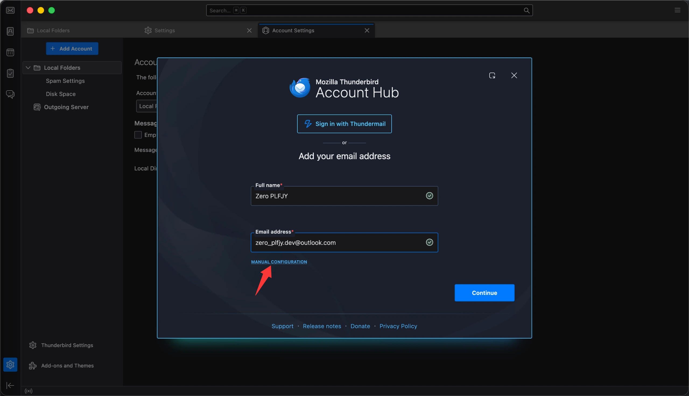
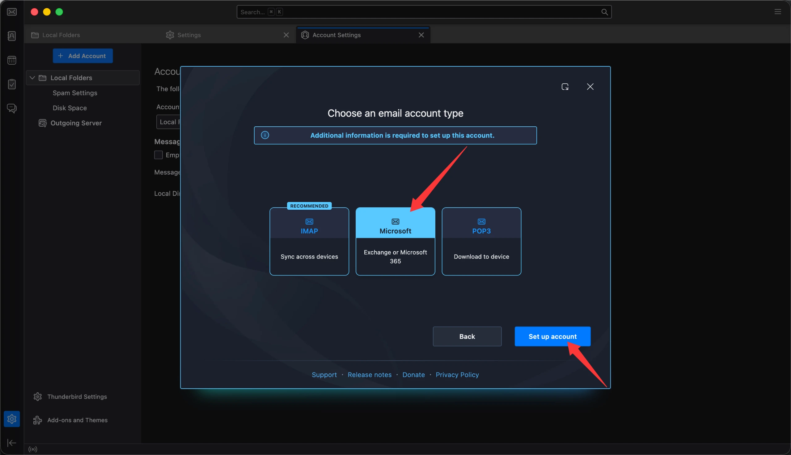
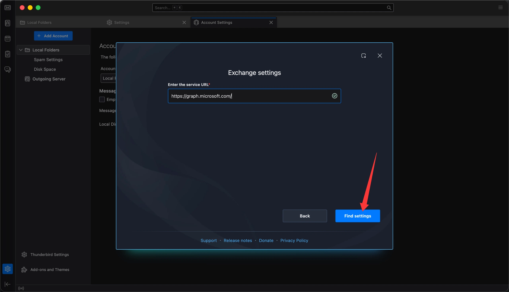
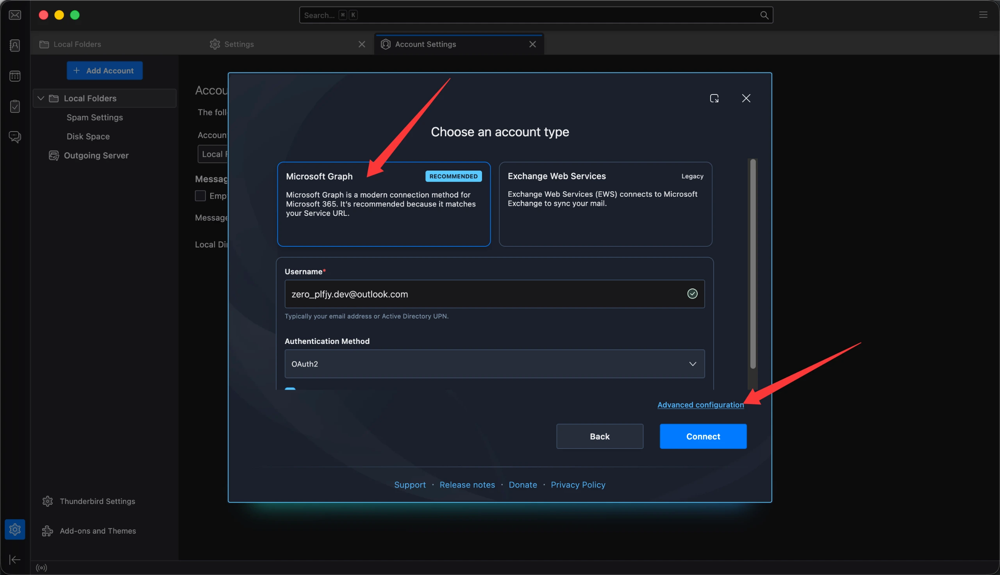
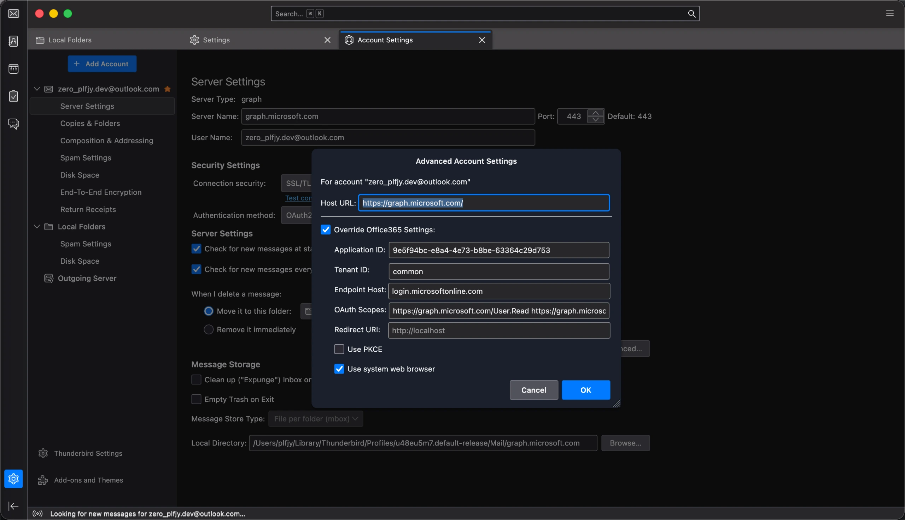
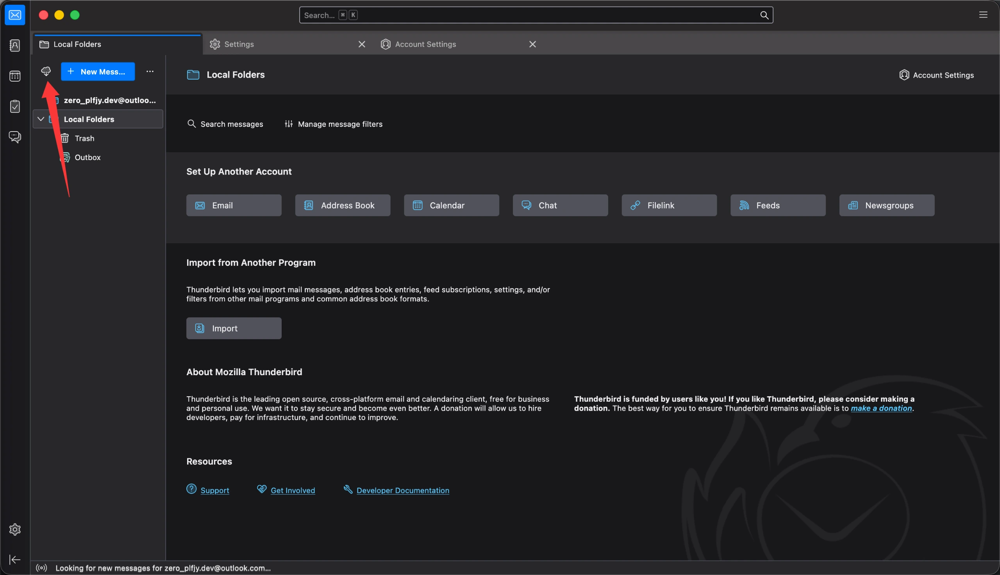

众所周知，Thunderbird 中登录 outlook 邮箱会让你选择 IMAP 或者 POP3，但是这两种方法都是会有同一个结果，尤其是新的 outlook 邮箱，它的 SMTP 默认是封死的，而且根本没法用，会报错 “Thunderbird Login to server smtp-mail.outlook.com with username @outlook.com failed.”

于是在我和 GPT 进行了激烈的讨论之后发现了一些端倪，微软基本上在个人用户的邮箱侧封死了 SMTP 发件的认证端口。转而推它自家的 Exchange 和 Graph API，那么今天我带来的是怎么正确利用 Graph API 在 Thunderbird 登录 outlook 邮箱。

首先需要保证 Thunderbird 版本在 1.5.3 以上

然后，在 Thunderbird 的登录界面填好名字和邮箱账号之后点击 Manual Configuration 手动配置，千万不要直接点击 Continue



接下来选择 Microsoft，不要选 IMAP 和 POP3，然后点击下一步



service URL 按按照如下填写，然后 Finish Settings：

```text
https://graph.microsoft.com/
```



然后选择 Microsoft Graph，认证方式保持 OAuth 默认，不要点击 Connect 连接，直接点击 Advanced Configuration



接着进入 Account Settings 账号设置 → Server Settings 服务器设置 → Advanced 高级，按照如下填写:

Application ID:
```text
9e5f94bc-e8a4-4e73-b8be-63364c29d753
```

这个是 Thunderbird 在微软那里注册的 Application ID

Tenant ID: 

```text
common
```

Endpoint Host: 

```text
login.microsoftonline.com
```

输入框报错不用管，不要加 `https://`

OAuth Scopes: 
```text
https://graph.microsoft.com/User.Read https://graph.microsoft.com/Mail.ReadWrite https://graph.microsoft.com/Mail.Send offline_access
```

Redirect URL 留空默认



最后点击 OK，回到收件箱，点击一下同步，在弹出的浏览器里面登录就好了



---

从技术层面看，这次问题的本质是 Microsoft 对部分个人邮箱关闭了 SMTP AUTH，而 Thunderbird 155 又尚未为 Personal Microsoft Account 提供完整的 Graph 自动配置。传统 SMTP 路径会直接被服务器返回 `SmtpClientAuthentication is disabled for the Mailbox`，但 Microsoft Graph 本身仍支持个人 MSA 的 `Mail.ReadWrite` 与 `Mail.Send`。

进一步测试发现，Thunderbird 155 内置的 Graph backend 实际上已经可以正常连接个人 Outlook.com，真正的阻塞点在于其默认 Graph OAuth scopes 额外请求了 `MailboxFolder.ReadWrite`。Personal MSA 不授予这一权限，导致账户验证失败。通过手动配置 Graph，并将 scope 调整为 `User.Read + Mail.ReadWrite + Mail.Send + offline_access` 后，收信、同步和发信均可正常工作。

这说明当前状态更准确地说是：Thunderbird 已经具备 Personal Outlook.com 所需的大部分 Graph 能力，只是官方配置和支持范围仍以 Microsoft 365 为主。因此这更像是一个账户类型适配和默认配置问题，而不是底层协议或 API 能力缺失。
