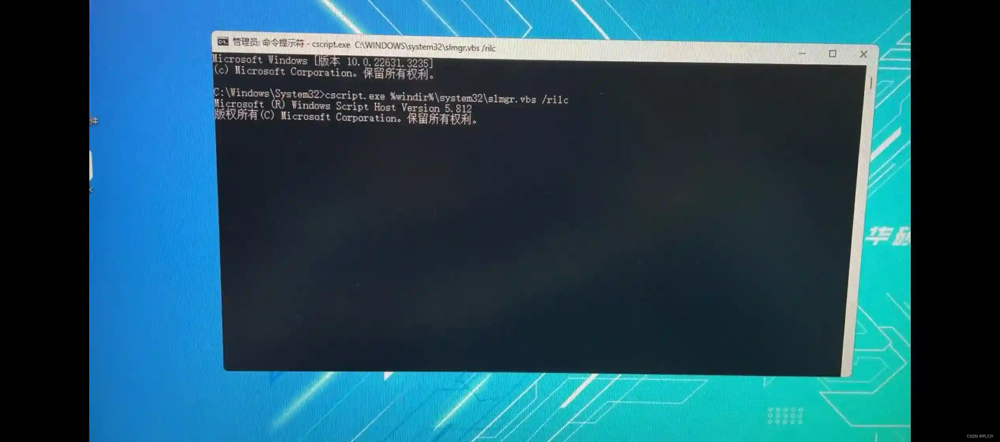
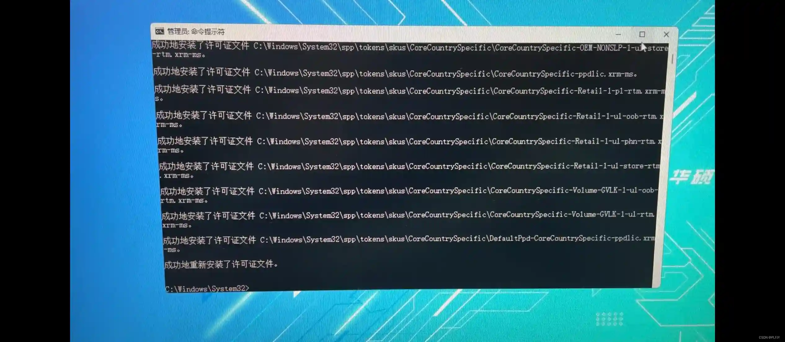
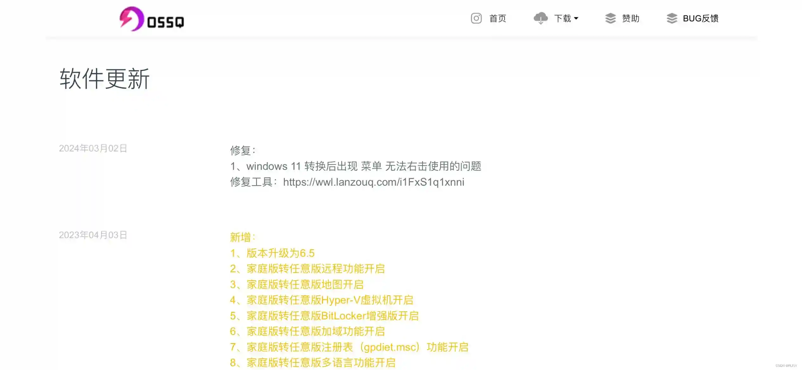

有些人在用这个版本[转换工具](https://so.csdn.net/so/search?q=转换工具&spm=1001.2101.3001.7020)的时候会出现无法右键开始菜单和win+x没有反应的问题，这个问题普遍出现在win11预览版和新的win11正式版，即使重置系统也不管用，我能查到的方法也都试无无果，都是只能重装系统 

我也是在询问作者后知道了问题所在，根本原因是微软在一次[win11](https://so.csdn.net/so/search?q=win11&spm=1001.2101.3001.7020)更新后更改了"C:\Windows\System32\sppui\"文件夹下的文件权限，使其从Administer变成了System，导致了换版本软件换版本后win+x菜单失效

具体解决方案是用纯净版win11的相应文件去替换这个文件夹下的文件并在cmd管理员下输“cscript.exe %windir%\system32\slmgr.vbs /rilc”等待操作完成后即可解决

作者也做出了懒人工具发在了官网，可以在更新日志里找到然后下载使用，[OSSQ版本转换官网](https://ossq.cn/switching.html) 这是软件的官网

